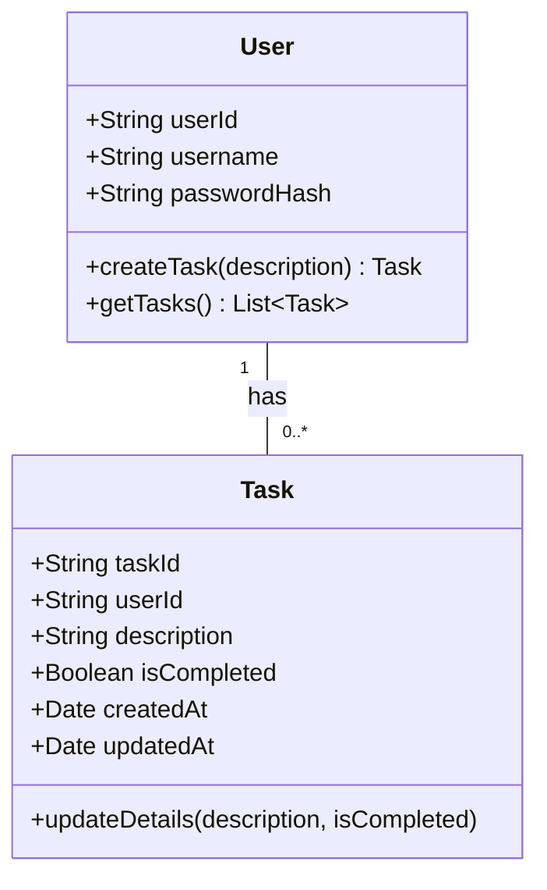
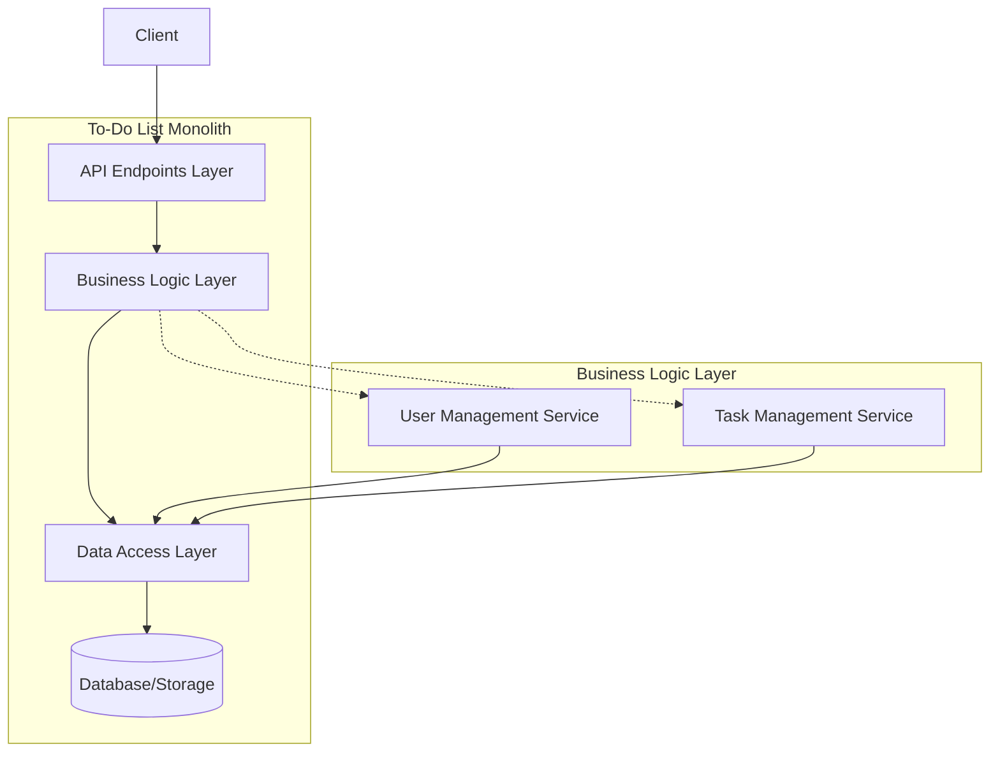
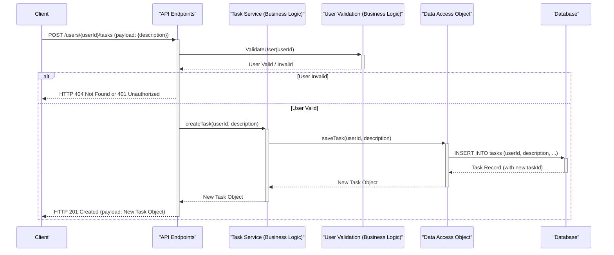

# Lab 1: Monolith Design Fundamentals

## 📚 Concepts to Learn

- API Design Principles (Statelessness, Idempotency, Resource Naming)
- RESTful Services Architecture
- HTTP Basics (Methods: GET, POST, PUT, DELETE; Status Codes: 2xx, 4xx, 5xx)
- Monolithic Architecture: Pros and Cons
- Basic Data Modeling

## 📊 Required Data Structures

- You must identify and represent these in your diagrams:

- **Arrays/Lists:** For collections of tasks or users.
- **Hash Maps/Dictionaries:** For representing individual task or user objects, and for query parameters.

## Whiteboarding Challenge

### Scenario

Design a **To-Do List API** using a Monolithic Architecture. This API will allow users to create, read, update, and delete tasks. Users should also be able to register and log in, and tasks should be associated with users.

### Required Diagrams

For this lab, you will create the following three diagrams to design the To-Do List API:

1.  **UML Class Diagram (Core Data Models):**
    - **Action:** Create a UML class diagram.
    - **Content:** Focus on modeling the primary data entities: `Task` and `User`.
      - For `Task`: Include attributes like `taskId`, `userId` (foreign key), `description`, `isCompleted`, `createdAt`, `updatedAt`.
      - For `User`: Include attributes like `userId`, `username`, `passwordHash` (or similar).
      - Clearly define the relationship between `User` and `Task` (e.g., one-to-many).
      - Include key methods for each class, such as `createTask()`, `getTaskById()`, `updateTaskDetails()`, `deleteTask()` for tasks, and `registerUser()`, `getUserById()` for users.
2.  **Component Diagram (Monolith Layers):**
    - **Action:** Create a component diagram.
    - **Content:** Illustrate the layered architecture of the monolithic To-Do List application. Clearly delineate and label these layers:
      - `Presentation Layer` (handling API Endpoints, e.g., `/tasks`, `/users`).
      - `Business Logic Layer` (containing services like `TaskManagementService` and `UserManagementService`).
      - `Data Access Layer` (responsible for database interactions, e.g., `TaskDAO`, `UserDAO`).
      - `Database/Storage Layer` (representing the persistent storage).
        Show the primary dependencies and flow of control between these layers.
3.  **API Endpoint Flow Diagram (Sequence Diagram for Task Creation):**
    - **Action:** Create a UML Sequence Diagram.
    - **Content:** Detail the precise sequence of interactions for the `POST /users/{userId}/tasks` endpoint (creating a new task for a specific user).
      - Participants should include: `Client`, `APILayer` (or Controller), `UserValidationService` (conceptual, for checking `userId`), `TaskService`, `DataAccessObject (DAO)`, and `Database`.
      - Show messages for request initiation, user validation, task creation logic, data persistence, and the response back to the client (including HTTP status codes like 201 Created).

### Critical Architectural Decisions (Visualize and Justify)

1.  **API Endpoint Structure and Data Models:**
    - **Visualization:** Diagram the proposed RESTful endpoint paths (e.g., `/users`, `/users/{id}`, `/users/{userId}/tasks`, `/tasks/{taskId}`). Show request/response JSON payloads.
    - **Justification:** Explain the choice of resource naming, HTTP methods, and payload structure for clarity, consistency, and adherence to REST principles.
2.  **Storage Mechanism:**
    - **Visualization:** A simple block diagram comparing an in-memory store (e.g., a hash map within the application) versus a relational database (e.g., PostgreSQL, MySQL). Show basic table structures if opting for a DB.
    - **Justification:** Discuss the pros and cons of starting with an in-memory solution for simplicity versus a persistent database for data durability and querying capabilities, considering the app's initial scale.
3.  **API Versioning Strategy:**
    - **Visualization:** Show examples of how API versions would be represented (e.g., URI versioning: `/v1/tasks`, `/v2/tasks`; Header versioning: `Accept: application/vnd.company.v1+json`).
    - **Justification:** Explain the chosen versioning approach and why it's suitable for managing future changes without breaking existing clients.

## ⚖️ Trade-off Discussion Points

1.  **Monolithic Simplicity vs. Scalability & Maintainability:**

    - **Visual Analysis:**
      - **Pros/Cons Table:**
        | Feature | Monolith (Pros) | Monolith (Cons) |
        |------------------|---------------------------------------------|------------------------------------------------------|
        | Development | Simpler initial setup, easier to debug | Can become complex, harder to manage large codebase |
        | Deployment | Single deployment unit | Entire application must be redeployed for any change |
        | Scalability | Scale entire application | Difficult to scale individual components |
        | Technology Stack | Single, unified stack | Technology lock-in, harder to adopt new tech |
        | Team Structure | Easier for small teams to manage | Can lead to coordination overhead in large teams |
      - **Decision Tree/Flowchart:** When does the complexity of a monolith warrant considering microservices?
        ```mermaid
        graph TD
            A[Start with Monolith] --> B{Is the application complex?};
            B -- No --> C[Continue with Monolith];
            B -- Yes --> D{Are different parts scaling differently?};
            D -- No --> C;
            D -- Yes --> E{Are teams working independently on modules?};
            E -- No --> C;
            E -- Yes --> F[Consider Microservices Transition];
        ```
    - **Discussion:** Debate when the initial benefits of a monolith (speed of development, unified codebase) are outweighed by its drawbacks (scaling bottlenecks, deployment complexities, tight coupling).

2.  **In-Memory Storage vs. Persistent Database:**
    - **Visual Analysis:**
      - **Pros/Cons Table:**
        | Feature | In-Memory Storage (Pros) | In-Memory Storage (Cons) | Persistent Database (Pros) | Persistent Database (Cons) |
        |----------------|--------------------------------------------|--------------------------------------------------|--------------------------------------------|---------------------------------------------|
        | Performance | Very fast access | Limited by RAM, data loss on restart | Slower than in-memory, but optimized | Disk I/O overhead |
        | Durability | No durability | Data lost on application stop/crash | High durability, data persists | Requires backup and maintenance strategies |
        | Scalability | Limited by single server's memory | Not easily scalable beyond one instance | Scalable (read replicas, sharding later) | Scaling can be complex |
        | Querying | Basic lookups, complex queries difficult | Limited query capabilities | Powerful querying (SQL) | Schema design complexity |
        | Cost | Low initial cost (uses app memory) | - | Higher cost (DB licenses, hosting) | - |
        | Development | Simple to set up for prototypes | - | More setup effort | ORM integration, schema migrations |
    - **Discussion:** When is it acceptable to use in-memory storage (e.g., for caching, session data, or very small, non-critical applications) versus when is a persistent database essential? Discuss the implications for data integrity, recovery, and scalability.

## 📝 Gandalf Notes

### Common Design Pitfalls:

- **Overly complex initial data models:** You might try to design for every conceivable feature at once. Encourage starting simple.
- **Ignoring RESTful principles:** Using POST for GET operations, inconsistent endpoint naming.
- **Poor error handling in API flow:** Not considering different HTTP status codes for success, client errors, and server errors.
- **Choosing a database without justification:** Picking a technology without understanding its implications for the monolith.
- **Not clearly defining component boundaries:** Leading to a "big ball of mud" even within the monolith.

### Ideal Visual Solutions:

- **UML Class Diagram:** Clear distinction between `User` and `Task` with a one-to-many relationship (one User can have many Tasks). Attributes should be primitive types or simple value objects.
- **Component Diagram:** Should clearly show the flow of control from API endpoints through service layers to data access, and finally to a distinct storage component.
- **API Endpoint Flow:** A sequence diagram showing synchronous calls. For instance, `Client -> API Layer -> UserService (for auth) -> TaskService -> DataAccessObject -> Database`.

### Key Discussion Points:

- Why start with a monolith for a new product? (Speed, simplicity).
- What are the first signs that a monolith is becoming problematic? (Slow deployments, difficult to scale specific features, conflicting resource needs).
- How does the choice of programming language/framework impact monolithic design?
- The importance of internal modularity even within a monolith (e.g., clear separation of concerns between different parts of the business logic).
- How API contracts (defined by endpoints and data models) are crucial even for internal communication within the monolith if it's well-structured.

### Example Diagrams:

**1. UML Class Diagram (Mermaid):**



_Supporting Code Example (Conceptual - Python/Java like pseudocode):_

```python
# Conceptual class structure for Task
class Task:
    def __init__(self, task_id: str, user_id: str, description: str):
        self.task_id = task_id
        self.user_id = user_id
        self.description = description
        self.is_completed = False
        # ... other attributes like createdAt, updatedAt

# Conceptual class structure for User
class User:
    def __init__(self, user_id: str, username: str):
        self.user_id = user_id
        self.username = username
        self.tasks = [] # List of Task objects

    def add_task(self, task: Task):
        self.tasks.append(task)
```

**2. Component Diagram (Mermaid):**



**3. API Endpoint Flow Diagram (Mermaid - Sequence for `POST /users/{userId}/tasks`):**



### Recommended Tools:

- Physical Whiteboards + Markers
- Digital Whiteboarding: Miro, Lucidspark
- Diagramming Tools: Lucidchart, draw.io (diagrams.net), Microsoft Visio
- Mermaid.js for markdown-based diagrams (as used in examples).

---
