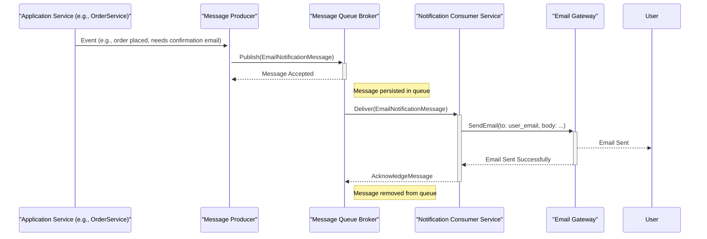

# Lab 3: Queue-Based Architectures

## 📚 Concepts to Learn

- Message Queues: Core concepts (Producer, Consumer, Broker, Queue, Topic, Message)
- Benefits of Asynchronous Processing (Decoupling, Scalability, Resilience, Responsiveness)
- Common Message Queue Systems (e.g., RabbitMQ, Apache Kafka, AWS SQS, Redis Streams)
- Message Durability and Persistence
- Dead Letter Queues (DLQs) and Retry Mechanisms
- Idempotency in Consumers
- Backpressure Handling

## 📊 Required Data Structures

You must identify and represent these in their diagrams:

- **Queues (FIFO, Priority):** Fundamental for buffering messages.
- **Circular Buffers (Conceptual):** For understanding fixed-size buffers, potentially relevant to some queue implementations or stream processing scenarios.
- **Hash Maps/Dictionaries:** For message metadata, tracking message states, or configuration.

## Whiteboarding Challenge

### Scenario

Design a scalable and reliable **Email Notification System**. This system is triggered by various events within a larger application (e.g., user registration, order confirmation, password reset). The system must be able to handle bursts of notification requests and ensure emails are sent reliably, even if the email sending service experiences temporary issues.

### Required Diagrams

For this lab, you will create the following three diagrams for the Email Notification System:

1.  **UML Sequence Diagram (Notification Flow):**
    - **Action:** Create a UML Sequence Diagram.
    - **Content:** Illustrate the complete end-to-end flow starting from an event occurring in a primary service (e.g., `OrderService`) to an email being successfully dispatched to the user.
      - Participants: `Primary Service` (e.g., OrderService), `Message Producer`, `Message Queue (Broker)`, `Message Consumer (Notification Service)`, `Email Gateway/Service`, and `User` (as the recipient).
      - Clearly show message publication to the queue, consumption from the queue, interaction with the email gateway, and the acknowledgment of message processing back to the queue.
2.  **Component Diagram (System Architecture):**
    - **Action:** Create a Component Diagram.
    - **Content:** Detail all key components and their interactions. You must include:
      - `Producer Applications` (e.g., OrderService, UserService).
      - `Message Queue Broker` (name a specific technology, e.g., RabbitMQ, Kafka).
      - `Notification Consumer Service` (show it as potentially multiple instances for scalability).
      - `Email Sending Gateway` (e.g., SendGrid, AWS SES).
      - `Database` (if used for storing email templates, tracking notification status - clearly label as optional if so).
      - `Dead Letter Queue (DLQ)` and its relationship to the main queue and consumer service.
3.  **Queue Flow Diagram (Message Lifecycle):**
    - **Action:** Create a conceptual flow or state diagram for a message.
    - **Content:** Visually represent the entire journey of a single notification message:
      - Message production by a producer and its entry into a main processing queue.
      - Consumption by a worker/consumer instance.
      - Path for successful processing and acknowledgment (message removal).
      - Path for a failure scenario: detail how a message moves to a DLQ after a defined number of retry attempts.
      - A separate conceptual flow for how messages in the DLQ are handled (e.g., manual inspection, automated alerts, re-processing logic).

### Critical Architectural Decisions (Visualize and Justify)

1.  **When to Trigger Asynchronous Jobs (Event Identification & Message Creation):**
    - **Visualization:** A flowchart or event diagram showing different application events (e.g., "User Registered", "Order Placed") and how they translate into specific messages being put onto the queue (e.g., `WelcomeEmailMessage`, `OrderConfirmationMessage`). Show message payload structure.
    - **Justification:** Explain the criteria for deciding which operations should be asynchronous. Justify the content and structure of the messages to ensure consumers have all necessary information.
2.  **Retry and Failure Handling Strategies (including DLQ usage):**
    - **Visualization:** A state diagram for a message, showing transitions from `Pending` -> `Processing` -> `Sent` or `Pending` -> `Processing` -> `Retry` -> `DLQ`. Diagram the DLQ with a separate consumer for manual inspection or automated alerts.
    - **Justification:** Explain the chosen retry policy (e.g., number of retries, backoff strategy). Justify the use of a DLQ for handling messages that consistently fail, preventing them from blocking the main queue.
3.  **Queue Design (e.g., Single vs. Multiple Queues, FIFO vs. Priority):**
    - **Visualization:** Diagram the queue setup. If multiple queues are used (e.g., one for transactional emails, one for marketing emails), show this. If priority is implemented, illustrate how higher priority messages might be processed sooner.
    - **Justification:** Defend the queue topology. If using multiple queues, explain why (e.g., to prevent high-volume, low-priority notifications from delaying critical ones). If using priority queues, explain the use case.

## ⚖️ Trade-off Discussion Points

1.  **Exactly-Once vs. At-Least-Once vs. At-Most-Once Delivery Semantics:**

    - **Visual Analysis:**

      - **Pros/Cons Table:**
        | Delivery Semantic | Pros | Cons | Typical Use Case |
        |-------------------|--------------------------------------------|-------------------------------------------------------------------|--------------------------------------|
        | At-Most-Once | Low overhead, fast | Messages can be lost | Non-critical logs, metrics |
        | At-Least-Once | Guarantees message processing | Messages can be processed multiple times (requires idempotent consumers) | Most common, e.g., email notifications |
        | Exactly-Once | Guarantees message processing once | Highest overhead, complex to implement, lower throughput | Financial transactions, critical ops |
      - **Diagram:** Simple visual showing potential message duplication in At-Least-Once and how an idempotent consumer handles it gracefully (e.g., by checking a processed ID).

        ```mermaid
        sequenceDiagram
            participant Producer
            participant Queue
            participant Consumer
            participant DataStore

            Producer->>Queue: Send Message M1 (ID: 123)
            Queue->>Consumer: Deliver M1
            Consumer->>DataStore: Process M1 (e.g., send email, mark 123 as processed)
            Consumer-->>Queue: Acknowledge M1

            Note over Queue: Network issue, ACK not received / Consumer crashes before ACK
            Queue->>Consumer: Redeliver M1 (At-Least-Once)
            Consumer->>DataStore: Check if ID 123 already processed
            alt ID 123 Processed (Idempotency)
                DataStore-->>Consumer: Already Processed
                Consumer-->>Queue: Acknowledge M1 (again)
            else ID 123 Not Processed
                Consumer->>DataStore: Process M1
                Consumer-->>Queue: Acknowledge M1
            end
        ```

    - **Discussion:** Analyze the implications of each delivery semantic for the email notification system. Why is At-Least-Once often chosen with idempotent consumers? When might At-Most-Once be acceptable, or Exactly-Once be strictly required (and what would it take to achieve it)?

2.  **Async Complexity & Debugging vs. System Reliability & Scalability:**
    - **Visual Analysis:**
      - **Pros/Cons Table for Asynchronous Architecture:**
        | Aspect | Synchronous (Pros) | Synchronous (Cons) | Asynchronous (Pros) | Asynchronous (Cons) |
        |------------------|--------------------------------------|-----------------------------------------------------|-----------------------------------------------------------|---------------------------------------------------|
        | Responsiveness | Immediate feedback (can be slow) | User waits for entire process | Fast initial response to user, work done in background | Eventual consistency, user doesn't see immediate end result|
        | Reliability | Simpler to reason about single flow | Failure in one part can block entire request | Decoupled, failure in consumer doesn't stop producer | Requires careful error handling, DLQs, monitoring |
        | Scalability | Harder to scale individual components| Bottlenecks affect whole system | Producers & Consumers scale independently | Queue can become bottleneck if not managed |
        | Complexity | Lower initial complexity | Tightly coupled components | Higher initial complexity (brokers, consumers, state) | Harder to debug distributed flow, tracing |
        | Debugging | Easier to trace a single request | - | More challenging to trace a message across systems | Needs good logging and monitoring tools |
      - **Diagram:** Contrast a synchronous call blocking the user vs. an asynchronous call returning immediately while work happens in the background.
    - **Discussion:** Debate the increased operational and debugging complexity introduced by message queues against the benefits of improved system resilience (handling downstream failures gracefully), scalability (handling bursts of requests), and user-perceived performance (quick API responses).

## 📝 Gandalf Notes

### Common Design Pitfalls:

- **Not making consumers idempotent:** Leading to duplicate emails if messages are redelivered.
- **No Dead Letter Queue (DLQ):** Failing messages can clog the main queue or be lost.
- **Insufficient monitoring of queue depth and consumer health:** Problems can go unnoticed until they escalate.
- **Choosing the wrong message broker for the workload:** E.g., using a simple queue when Kafka's stream processing might be better, or vice-versa.
- **Storing large blobs directly in messages:** Better to store a reference (e.g., S3 URL) if the data is large.
- **Synchronous operations within an asynchronous consumer:** Defeats the purpose if the consumer blocks for a long time on external calls without proper async handling internally.

### Ideal Visual Solutions:

- **Sequence Diagram:** Clearly distinguish actions of producer, broker, and consumer. Show acknowledgment path.
- **Component Diagram:** Show clear separation of concerns: applications produce, broker routes, consumers process. DLQ should be visible.
- **Queue Flow Diagram:** Simple, clear path for a message, including retry loops and the path to the DLQ.

### Key Discussion Points:

- The role of the message broker as an intermediary.
- Importance of message acknowledgment for reliability.
- How to design idempotent consumers (e.g., using unique job IDs, checking if work already done).
- Strategies for scaling consumers (e.g., multiple instances reading from the same queue).
- Backpressure: what happens if producers generate messages faster than consumers can process them?
- Choosing between different queue types (standard, FIFO, priority) based on requirements.

### Example Diagrams:

**1. UML Sequence Diagram (Notification Flow - Mermaid):**



**2. Component Diagram (Mermaid):**

```mermaid
graph TD
    subgraph ProducerApplications
        P1[UserService]
        P2[OrderService]
        P3[OtherAppService]
    end

    subgraph NotificationSystem
        Broker[Message Queue Broker (e.g., RabbitMQ)]
        ConsumerPool[Notification Consumer Service Instances]
        DLQ[Dead Letter Queue]
        EmailGateway[Email Sending Gateway]
        ConfigDB[(Optional Config/Template DB)]
    end

    P1 -- Publishes Messages --> Broker
    P2 -- Publishes Messages --> Broker
    P3 -- Publishes Messages --> Broker

    Broker -- Delivers Messages --> ConsumerPool
    ConsumerPool -- Processes Messages & Sends --> EmailGateway
    ConsumerPool -- On Failure/Retry Exhaustion --> DLQ
    ConsumerPool -- Reads Config/Templates --> ConfigDB

    DLQMonitor[DLQ Monitoring/Alerting Service] --> DLQ
```

**3. Queue Flow Diagram (Conceptual - Mermaid):**

```mermaid
graph TD
    A[Message Produced] --> B(Main Processing Queue)
    B --> C{Consumer Fetches Message}
    C --> D{Process Message}
    D -- Success --> E[Acknowledge Message]
    D -- Failure (Retryable) --> F{Retry Logic (e.g., exponential backoff)}
    F -- Attempt < Max --> C
    F -- Attempt >= Max --> G(Dead Letter Queue - DLQ)
    E --> H[Message Processed & Removed]
    G --> I[DLQ Consumer for Inspection/Alerting]
```

### Recommended Tools:

- Physical Whiteboards + Markers
- Digital Whiteboarding: Miro, Lucidspark
- Diagramming Tools: Lucidchart, draw.io (diagrams.net)
- Mermaid.js for markdown-based diagrams.
