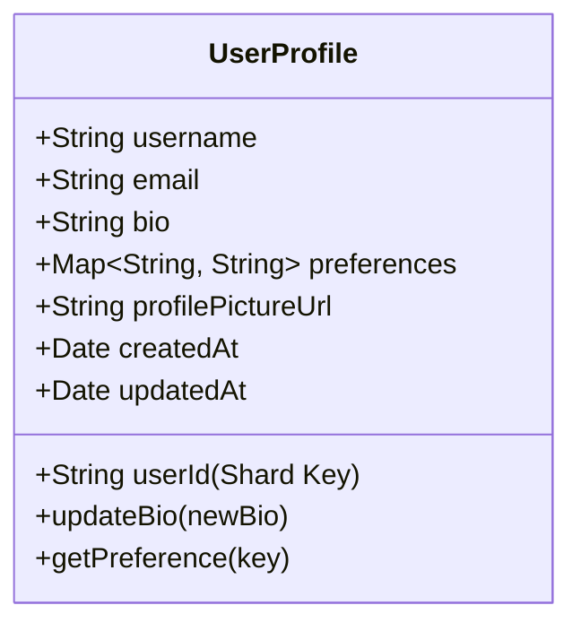

# Lab 4: Data Partitioning & Sharding

## 📚 Concepts to Learn

- Database Sharding: Principles and Strategies (Range-Based, Hash-Based, Directory-Based)
- Data Replication: Master-Slave, Master-Master, Quorum-Based
- Consistent Hashing: How it works, benefits for scalability and rebalancing.
- CAP Theorem (Consistency, Availability, Partition Tolerance) and its implications for distributed databases.
- Hotspots and how to mitigate them.
- Cross-Shard Queries and Transactions: Challenges and solutions.

## 📊 Required Data Structures

You must identify and represent these in their diagrams:

- **Consistent Hashing Rings:** To visualize how data and nodes are mapped.
- **Hash Maps/Dictionaries:** For shard lookup directories, storing shard metadata.
- **Range Maps (Conceptual):** For range-based sharding strategies.

## Whiteboarding Challenge

### Scenario

Design a **High-Scale User Profile Service** for a rapidly growing social media application. The service needs to store and retrieve user profile information (e.g., username, email, bio, preferences, profile picture URL) for hundreds of millions of users, with low latency and high availability. The system must be able to handle a high volume of reads and writes.

### Required Diagrams

For this lab, you will create the following three diagrams for the High-Scale User Profile Service:

1.  **UML Class Diagram (Data Models & Shard Key):**
    - **Action:** Create a UML Class Diagram.
    - **Content:** Model the `User` and `Profile` entities (or a combined `UserProfile`).
      - Include key attributes such as `userId`, `username`, `email`, `bio`, `profileSettings`, `lastLogin`.
      - Crucially, you must explicitly identify and mark the chosen **shard key** (e.g., `userId`) within this data model diagram.
2.  **Consistent Hashing Ring Diagram (Data Distribution):**
    - **Action:** Create a Consistent Hashing Ring diagram.
    - **Content:** Visually illustrate how user data is distributed across multiple database shards using consistent hashing.
      - Show the ring itself.
      - Map several example `userId`s (or your chosen shard key values) to specific points on this ring after hashing.
      - Show physical database shards (nodes) mapped to distinct segments or arcs of the ring.
      - Briefly demonstrate (e.g., with an added/removed node) how consistent hashing minimizes data remapping when a shard is added or removed.
3.  **Data Replication Flow Diagram (Primary-Secondary):**
    - **Action:** Create a flow diagram (e.g., sequence or activity diagram).
    - **Content:** For a single logical shard, show how data written to its primary (master) database node is then replicated to its secondary (slave/replica) database nodes.
      - Illustrate a write operation being directed to the primary.
      - Show the replication process (synchronous or asynchronous) to at least two replicas.
      - Illustrate a read operation being potentially served by one of the replicas.
      - Conceptually depict a failure scenario (e.g., primary shard down) and how a read might be redirected to an available replica (or how a replica might be promoted, if discussing that level of detail).

### Critical Architectural Decisions (Visualize and Justify)

1.  **Selection of Shard Key(s):**
    - **Visualization:** Show the chosen shard key (e.g., `userId`) in the User Profile data model. Illustrate how different `userId`s would map to different shards using the chosen sharding strategy (e.g., hash of `userId` modulo N shards).
    - **Justification:** Explain why the chosen shard key provides good data distribution, avoids hotspots, and aligns with common query patterns (e.g., most queries are for a specific user's profile).
2.  **Strategy for Replication and Fault Tolerance:**
    - **Visualization:** Diagram a primary-secondary (master-slave) replication setup for a single shard. Show write operations going to the primary and then asynchronously or synchronously replicated to secondaries. Depict how read traffic can be split between primary and secondaries.
    - **Justification:** Explain the chosen replication strategy (e.g., asynchronous master-slave for read scalability and decent write performance). Discuss the number of replicas and how it contributes to fault tolerance and read capacity. Address consistency implications.
3.  **Handling Cross-Shard Queries (if applicable, or explain why minimized):**
    - **Visualization:** If queries spanning multiple shards are anticipated (e.g., searching users by a non-sharded attribute), diagram how an aggregator or scatter-gather component would query multiple shards and combine results. Alternatively, explain how the design minimizes such queries.
    - **Justification:** Discuss the complexity of cross-shard operations. If the design aims to avoid them, explain how (e.g., by denormalizing data or choosing shard keys that localize most queries). If they are necessary, justify the approach to handle them.

## ⚖️ Trade-off Discussion Points

1.  **Availability vs. Consistency (CAP Theorem in Sharded/Replicated Systems):**

    - **Visual Analysis:**

      - **CAP Theorem Triangle Diagram:**

        ```mermaid
        graph TD
            subgraph CAP Theorem
                C((Consistency))
                A((Availability))
                P((Partition Tolerance))
            end
            C <-.-> A
            A <-.-> P
            P <-.-> C
            Note right of A: In a distributed system,
            Note right of A: you can only pick two.
            Note right of A: Partition Tolerance is usually a must.
            CP[CP System (e.g., some Paxos-based systems)]
            AP[AP System (e.g., Cassandra, DynamoDB-eventual)]
            CA[CA System (Traditional RDBMS - not truly for distributed partitioning)]

            P --- CP
            P --- AP
        ```

      - **Pros/Cons Table (Focusing on Strong vs. Eventual Consistency in a sharded setup):**
        | Feature | Strong Consistency (e.g., RDBMS with synchronous replication) | Eventual Consistency (e.g., NoSQL with asynchronous replication) |
        |--------------------------|--------------------------------------------------------------|-------------------------------------------------------------------|
        | Data Freshness | Reads always get the latest write | Reads might get stale data temporarily |
        | Availability (on P) | May sacrifice availability to ensure consistency (writes block) | Higher availability, reads/writes can proceed on available nodes |
        | Write Latency | Higher (waits for acknowledgments) | Lower (writes to local replica quickly) |
        | Read Latency | Potentially higher if waiting for consistent view | Lower (reads from nearest/available replica) |
        | Complexity | More complex to manage consensus | Simpler write path, but application must handle stale data |

    - **Discussion:** How does the choice of sharding and replication strategy impact where the User Profile Service sits on the CAP spectrum? If aiming for high availability (AP), what are the implications for data consistency (e.g., a user updates their profile pic, but an older pic is shown briefly on some replicas)? If aiming for strong consistency (CP), what are the availability trade-offs during network partitions or node failures?

2.  **Sharding Strategy: Algorithmic (Hash/Range) vs. Directory-Based Sharding:**
    - **Visual Analysis:**
      - **Diagram Comparison:**
        - **Hash Sharding:** Show `Key -> Hash Function -> Shard ID`.
        - **Range Sharding:** Show `Key Ranges -> Shard Mapping` (e.g., UserID 1-1M -> Shard 1, 1M-2M -> Shard 2).
        - **Directory-Based:** Show `Key -> Directory Service -> Shard ID` (Directory itself might be sharded/replicated).
      - **Pros/Cons Table:**
        | Feature | Algorithmic (Hash/Range) | Directory-Based |
        |----------------------|------------------------------------------------|------------------------------------------------|
        | Data Distribution | Hash: good random. Range: can have hotspots | Flexible, can be optimized |
        | Rebalancing | Hash: complex (consistent hashing helps). Range: easier to split ranges. | Simpler rebalancing logic by updating directory|
        | Hotspot Management | Harder to mitigate dynamically | Can redirect traffic by updating directory |
        | Lookup Overhead | Low (computation) | Higher (extra network hop to directory) |
        | Implementation Complexity | Simpler client logic | Directory becomes a critical component, needs HA |
    - **Discussion:** Compare the pros and cons of different sharding strategies for the User Profile service. Why might consistent hashing be preferred over simple modulo hashing? When would a directory-based approach offer advantages despite its added complexity and potential SPOF (if not made HA)?

## 📝 Gandalf Notes

### Common Design Pitfalls:

- **Choosing a poor shard key:** Leading to uneven data distribution (hotspots) or many cross-shard queries.
- **Ignoring replication:** Creating single points of failure at the shard level.
- **Underestimating rebalancing complexity:** What happens when shards need to be added or removed?
- **Not considering query patterns:** Sharding strategy might not align with how data is typically accessed.
- **Complexity of distributed transactions:** Trying to enforce ACID across shards without understanding the difficulty.
- **Neglecting the CAP theorem:** Making unrealistic assumptions about consistency and availability.

### Ideal Visual Solutions:

- **UML Class Diagram:** `UserProfile` entity with `userId` clearly marked as a shard key candidate.
- **Consistent Hashing Ring:** Show several `userId` examples hashing to different points on the ring, and server nodes covering arcs of the ring. Visually demonstrate node addition/removal causing minimal key remapping.
- **Replication Flow:** A primary node receiving a write, then fanning out the update to two or more replicas. Show a read request hitting a replica.

### Key Discussion Points:

- How does the shard key choice impact query performance and data distribution?
- The difference between horizontal partitioning (sharding) and vertical partitioning.
- Synchronous vs. Asynchronous replication: trade-offs in consistency, performance, and availability.
- How to handle schema changes in a sharded database environment.
- Strategies for data migration when re-sharding or rebalancing.
- Monitoring sharded databases: shard health, data distribution, query latency per shard.

### Example Diagrams:

**1. UML Class Diagram (Mermaid):**



_Supporting Code Example (Conceptual - Python/Java like pseudocode for data model):_

```python
class UserProfile:
    def __init__(self, user_id: str, username: str, email: str):
        self.user_id = user_id # Potential Shard Key
        self.username = username
        self.email = email
        self.bio = ""
        self.preferences = {}
        self.profile_picture_url = ""
        # ... other attributes
```

**2. Consistent Hashing Ring Diagram (ASCII - Conceptual):**

```
          +---------------------+
         /                       \
        |        Node A           |
        | (Shard 1: 0-100)        |
         \                       /
          +---------^-----------+
                   /|\
                  / | \
                 /  |  \
  (Key: user_X hashes to 50)    (Key: user_Y hashes to 150)
                 \  |  /
                  \ | /
                   \|/
          +---------v-----------+
         /                       \
        |        Node B           |
        | (Shard 2: 101-200)      |
         \                       /
          +---------------------+
                |           |
(Key: user_Z hashes to 250) | (Ring wraps around)
                V           |
          +---------------------+
         /                       \
        |        Node C           |
        | (Shard 3: 201-300)      |
         \                       /
          +---------------------+
```

_Mermaid for Consistent Hashing (Conceptual - harder to show node ranges directly, focuses on key distribution):_

```mermaid
graph TD
    subgraph Consistent Hashing Ring
        direction LR
        KH1[Hash(UserA_ID) = 30] --> S1[Shard 1]
        KH2[Hash(UserB_ID) = 120] --> S2[Shard 2]
        KH3[Hash(UserC_ID) = 210] --> S3[Shard 3]
        KH4[Hash(UserD_ID) = 80] --> S1
        KH5[Hash(UserE_ID) = 180] --> S2
        KH6[Hash(UserF_ID) = 280] --> S3
        Note: Shards own ranges on the ring.
        S1 --- S2 --- S3 --- S1 ; Ring linked
    end
    UserA_ID --> KH1
    UserB_ID --> KH2
    UserC_ID --> KH3
    UserD_ID --> KH4
    UserE_ID --> KH5
    UserF_ID --> KH6
```

**3. Data Replication Flow Diagram (Master-Slave - Mermaid):**

```mermaid
sequenceDiagram
    participant ClientApp as "Client Application"
    participant Router as "Query Router/LB"
    participant Shard1_Primary as "Shard 1 Primary"
    participant Shard1_ReplicaA as "Shard 1 Replica A"
    participant Shard1_ReplicaB as "Shard 1 Replica B"

    ClientApp->>+Router: WRITE UserProfile (userId_X)
    Router->>+Shard1_Primary: Store UserProfile (userId_X)
    Shard1_Primary-->>Router: Write Ack
    Router-->>-ClientApp: Success

    par Async Replication
        Shard1_Primary->>Shard1_ReplicaA: Replicate Data (userId_X)
        Shard1_ReplicaA-->>Shard1_Primary: Ack (Optional)
    and
        Shard1_Primary->>Shard1_ReplicaB: Replicate Data (userId_X)
        Shard1_ReplicaB-->>Shard1_Primary: Ack (Optional)
    end

    ClientApp->>+Router: READ UserProfile (userId_X)
    alt Read from Replica
        Router->>+Shard1_ReplicaA: Get UserProfile (userId_X)
        Shard1_ReplicaA-->>-Router: UserProfile Data
        Router-->>-ClientApp: UserProfile Data
    else Read from Primary (if replica lag is a concern or replica down)
        Router->>+Shard1_Primary: Get UserProfile (userId_X)
        Shard1_Primary-->>-Router: UserProfile Data
        Router-->>-ClientApp: UserProfile Data
    end
```

### Recommended Tools:

- Physical Whiteboards + Markers
- Digital Whiteboarding: Miro, Lucidspark
- Diagramming Tools: Lucidchart, draw.io (diagrams.net)
- Mermaid.js for markdown-based diagrams.

---
