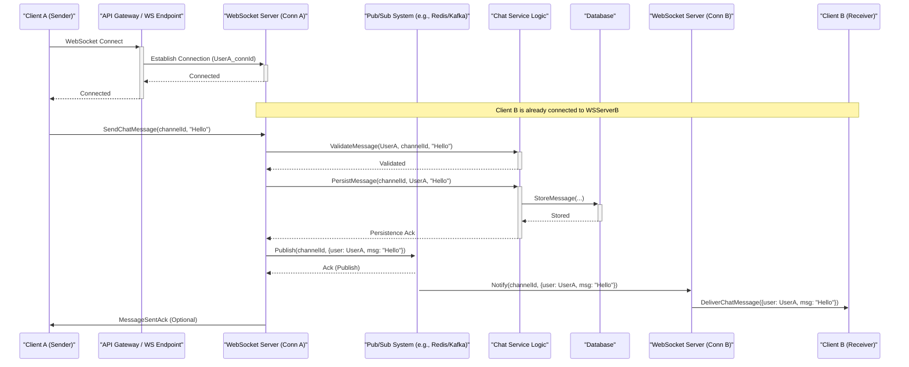

# Lab 5: Real-Time Systems

## 📚 Concepts to Learn

- Real-Time Communication Protocols: WebSockets, Server-Sent Events (SSE), Long Polling.
- Publish/Subscribe (Pub/Sub) Pattern for real-time message distribution.
- Event-Driven Architecture in the context of real-time updates.
- Scalability challenges in real-time systems (connection management, message fan-out).
- State Management for connected clients.
- Rate Limiting techniques (Token Bucket, Leaky Bucket, Sliding Window Log/Counter).
- Message Ordering and Delivery Guarantees in real-time scenarios.

## 📊 Required Data Structures

You must identify and represent these in their diagrams:

- **Queues:** For buffering incoming messages, managing tasks for broadcasting.
- **Hash Maps/Dictionaries:** For managing WebSocket connections (e.g., `userId` to `connectionId`), tracking subscriptions (e.g., `channelId` to list of `userIds`), rate limiting counters.
- **Bloom Filters (Conceptual):** For efficiently checking if a user has received a message or for presence systems (optional, advanced).
- **Sliding Windows (Counters/Logs):** For visualizing and implementing rate limiting.

## Whiteboarding Challenge

### Scenario

Design a **Real-Time Chat Application** (like Slack or WhatsApp) capable of supporting 1 million concurrent users. The application should allow users to send and receive messages in private chats and group channels in real-time. It also needs to handle user presence (online/offline status) and implement rate limiting to prevent abuse.

### Required Diagrams

For this lab, you will create the following three diagrams for the Real-Time Chat Application:

1.  **UML Sequence Diagram (Message Flow from User A to User B/Group):**
    - **Action:** Create a UML Sequence Diagram.
    - **Content:** Illustrate the detailed sequence of events when User A sends a message to either User B (private chat) or a group channel that User B is part of.
      - Participants: `User A Client`, `API Gateway/Load Balancer`, `WebSocket Server (handling User A's connection)`, `Pub/Sub System` (e.g., Redis Pub/Sub, Kafka), `Chat Service/Logic`, `Database` (for message persistence), `WebSocket Server (handling User B's connection, if different)`, and `User B Client`.
      - Show message transmission from User A, handling by User A's WebSocket server, message validation and persistence via Chat Service/Logic and Database, publishing to the Pub/Sub system, fan-out to User B's WebSocket server (or all relevant servers for a group), and final delivery to User B's client. Include conceptual steps for updating user presence if relevant to the flow.
2.  **Pub/Sub Architecture Diagram (Component View for Message Fan-out):**
    - **Action:** Create a Component Diagram with a focus on the Pub/Sub mechanism.
    - **Content:** Detail the components involved in achieving real-time message fan-out. You must include:
      - `Client Applications` (Web/Mobile).
      - `API Gateway / WebSocket Termination Point`.
      - A cluster of `WebSocket Servers` responsible for managing persistent client connections.
      - The core `Pub/Sub System` (name a specific technology, e.g., Redis Pub/Sub, Kafka).
      - `Chat Service/Logic` (interacts with Pub/Sub for publishing, and with DB for persistence/user management).
      - `Database` (for message history, user data, channel metadata).
      - Show how WebSocket servers subscribe to relevant channels/topics in the Pub/Sub system and how they publish messages to it. Illustrate how a message published on a topic is fanned out by the Pub/Sub system to all subscribed WebSocket servers, which then relay it to their connected clients.
3.  **Rate Limiting Visualization (Sliding Window Algorithm):**
    - **Action:** Create a diagram or visual explanation.
    - **Content:** Clearly explain and visually demonstrate how the sliding window algorithm (either sliding window log or sliding window counter) works to implement rate limiting for user requests (e.g., messages sent per minute).
      - Show a timeline with incoming requests from a specific user/IP.
      - Illustrate the concept of the "window" sliding over this timeline.
      - Show how requests are counted within the current window and how decisions (allow/deny) are made based on whether the count exceeds a predefined limit. Provide specific examples of allowed and denied requests.

### Critical Architectural Decisions (Visualize and Justify)

1.  **Real-Time Communication Protocol Selection (WebSockets vs. SSE vs. Long Polling):**
    - **Visualization:** A table comparing WebSockets, SSE, and Long Polling across features like bidirectionality, overhead, browser support, and complexity. A simplified diagram showing the connection lifecycle for the chosen protocol (e.g., WebSocket handshake and persistent connection).
    - **Justification:** Explain why the chosen protocol (likely WebSockets for a chat app) is the most suitable for bidirectional, low-latency communication required by the chat application.
2.  **Rate Limiting Strategy and Placement:**
    - **Visualization:** Diagram where rate limiting is enforced (e.g., at the API Gateway, within the WebSocket server, or in a dedicated service). Show the chosen algorithm (e.g., token bucket or sliding window) with a simple state flow.
    - **Justification:** Explain the rationale for the chosen rate limiting algorithm and its placement in the architecture to protect backend services from overload and abuse, while ensuring fair usage.
3.  **Trade-offs in Message Ordering and Delivery Guarantees:**
    - **Visualization:** A sequence diagram illustrating a scenario where messages might arrive out of order without specific handling, and another showing a mechanism to ensure order (e.g., sequence numbers + client-side buffering/reordering) or at-least-once delivery with deduplication.
    - **Justification:** Discuss the desired level of message ordering (e.g., per-channel ordering) and delivery guarantees (e.g., at-least-once) for the chat application. Explain the chosen mechanisms and their impact on complexity and performance.

## ⚖️ Trade-off Discussion Points

1.  **Latency vs. Consistency vs. Cost in Real-Time Systems:**

    - **Visual Analysis:**
      - **Trade-off Triangle/Slider:** A conceptual diagram showing how pulling levers for lower latency might affect consistency (e.g., messages might be seen by some users slightly before others) or cost (e.g., more powerful infrastructure, more complex synchronization).
      - **Pros/Cons Table (e.g., for different consistency models in chat message display):**
        | Feature | Strong Global Order (High Consistency) | Per-Channel Order (Medium Consistency) | Best Effort (Low Consistency, High Availability) |
        |------------------------|----------------------------------------|----------------------------------------|---------------------------------------------------|
        | User Experience (Order)| All users see messages identically | Messages ordered within a channel | Messages may appear slightly out of order |
        | Latency | Potentially higher | Moderate | Lowest |
        | Complexity | Very High | Moderate | Lower |
        | Scalability/Throughput | Can be a bottleneck | Good | Highest |
        | Cost | Higher (synchronization overhead) | Moderate | Lower |
    - **Discussion:** For a chat application, what is an acceptable trade-off? Is it critical that all users in a large group see messages in the exact same absolute order, or is per-channel/per-conversation ordering sufficient? How does striving for stricter consistency impact latency and the cost of the system (e.g., needing more sophisticated state management or consensus mechanisms)?

2.  **Managing Connection State: Stateful vs. Stateless WebSocket Servers:**
    - **Visual Analysis:**
      - **Diagram Comparison:**
        - **Stateful Server:** Shows user connection state (e.g., subscribed channels, connection ID) held directly on the WebSocket server instance they are connected to.
        - **Stateless Server:** Shows WebSocket servers that can handle any user's messages because connection state is stored externally (e.g., in Redis, a distributed cache) and looked up on each message.
      - **Pros/Cons Table:**
        | Feature | Stateful WebSocket Servers | Stateless WebSocket Servers (with external state store) |
        |------------------|-------------------------------------------|-------------------------------------------------------|
        | Simplicity | Simpler initial logic (state is local) | More complex (external lookup needed) |
        | Scalability | Harder to scale/load balance (sticky sessions) | Easier to scale horizontally, no sticky sessions |
        | Fault Tolerance | User disconnects if server fails | User can reconnect to any server, state preserved |
        | Message Routing | Simpler if message arrives at correct server | Requires Pub/Sub or lookup to find target server |
        | Resource Usage | Memory usage per server can grow high | External store becomes a dependency |
    - **Discussion:** Discuss the pros and cons of designing WebSocket servers to be stateful (holding connection-specific data in memory) versus stateless (offloading connection state to an external store like Redis). How does this choice affect scalability, fault tolerance, and the complexity of routing messages from the Pub/Sub system back to the correct client?

## 📝 Gandalf Notes

### Common Design Pitfalls:

- **Not using a Pub/Sub system for fan-out:** Trying to manage broadcasts directly from one WebSocket server to all connections, which doesn't scale.
- **Ignoring connection limits:** Each server has a finite number of connections it can handle.
- **Poor rate limiting implementation:** Either too restrictive, blocking legitimate users, or too loose, allowing abuse.
- **No strategy for message persistence:** Chat history is lost if not stored.
- **Inefficient presence management:** Constantly polling or broadcasting presence updates can create a lot of noise.
- **Blocking operations in WebSocket handlers:** Freezing the server's event loop.

### Ideal Visual Solutions:

- **Sequence Diagram:** Clearly show the role of the Pub/Sub system in decoupling the sender's WebSocket server from the receiver(s)' WebSocket server(s).
- **Pub/Sub Architecture Diagram:** Emphasize the cluster of WebSocket servers subscribing to topics/channels in the Pub/Sub system. Show how a message published to a topic is delivered to all subscribed servers, which then forward to their connected clients.
- **Rate Limiting Visualization:** A clear timeline demonstrating request acceptance/rejection based on the window's state.

### Key Discussion Points:

- Why WebSockets are generally preferred for chat over SSE or Long Polling.
- The importance of a robust Pub/Sub backbone for scaling message delivery.
- Different strategies for user presence (e.g., last active time, explicit online/offline events via WebSockets).
- How to scale the WebSocket server layer (horizontal scaling with a load balancer).
- Handling disconnections and reconnections gracefully.
- Security considerations for WebSockets (WSS, authentication, authorization for channels).

### Example Diagrams:

**1. UML Sequence Diagram (Chat Message Flow - Mermaid):**



**2. Pub/Sub Architecture Diagram (Mermaid):**

```mermaid
graph TD
    subgraph Users
        U1[User Client 1 (Web/Mobile)]
        U2[User Client 2 (Web/Mobile)]
        UN[User Client N ...]
    end

    subgraph NetworkEdge
        LB[Load Balancer / API Gateway]
    end

    subgraph WebSocketConnectionTier
        WS1[WebSocket Server 1]
        WS2[WebSocket Server 2]
        WSN[WebSocket Server N ...]
    end

    subgraph MessagingBackbone
        PubSub[Pub/Sub System (e.g., Kafka, Redis Pub/Sub)]
    end

    subgraph ApplicationLogicTier
        ChatSvc[Chat Service (Business Logic, Persistence)]
        UserSvc[User Service (Auth, Presence)]
    end

    subgraph StorageTier
        MsgDB[(Message History DB)]
        UserDB[(User/Channel DB)]
        Cache[(Presence/Session Cache)]
    end

    U1 -- Connects via WebSocket --> LB
    U2 -- Connects via WebSocket --> LB
    UN -- Connects via WebSocket --> LB

    LB -- Distributes Connections --> WS1
    LB -- Distributes Connections --> WS2
    LB -- Distributes Connections --> WSN

    WS1 -- Manages Connections & Subscribes/Publishes --> PubSub
    WS2 -- Manages Connections & Subscribes/Publishes --> PubSub
    WSN -- Manages Connections & Subscribes/Publishes --> PubSub

    WS1 -- Interacts --> ChatSvc
    WS2 -- Interacts --> ChatSvc
    WSN -- Interacts --> ChatSvc
    WS1 -- Interacts --> UserSvc
    WS2 -- Interacts --> UserSvc
    WSN -- Interacts --> UserSvc

    ChatSvc -- Uses --> PubSub
    ChatSvc -- Stores/Retrieves --> MsgDB
    UserSvc -- Stores/Retrieves --> UserDB
    UserSvc -- Uses --> Cache
    PubSub -- Notifies (Fanout) --> WS1
    PubSub -- Notifies (Fanout) --> WS2
    PubSub -- Notifies (Fanout) --> WSN
```

**3. Rate Limiting Visualization (Sliding Window Log - Conceptual ASCII):**

```
Window Size: 60 seconds, Limit: 5 requests

Time:   0s  10s  15s  20s  25s  30s  35s  40s  45s  50s  55s  60s  65s  70s
Events: R1       R2   R3                    R4                   R5   R6 (deny) R7 (allow)

Window at T=60s: [R1, R2, R3, R4, R5] - Count = 5. Next request (R6) at T=60s is denied.
Log: (ts:0,R1), (ts:15,R2), (ts:20,R3), (ts:35,R4), (ts:55,R5)

Window at T=65s (R1 slides out): [R2, R3, R4, R5] - Count = 4. Next request (R7) at T=65s is allowed.
Log: (ts:15,R2), (ts:20,R3), (ts:35,R4), (ts:55,R5), (ts:65,R7)

[------------------- Window (60s) --------------------]
  ^                                                   ^
 Start                                                End
Requests are timestamped. Window slides. Count requests within current window start/end.
```

### Recommended Tools:

- Physical Whiteboards + Markers
- Digital Whiteboarding: Miro, Lucidspark
- Diagramming Tools: Lucidchart, draw.io (diagrams.net)
- Mermaid.js for markdown-based diagrams.

---
