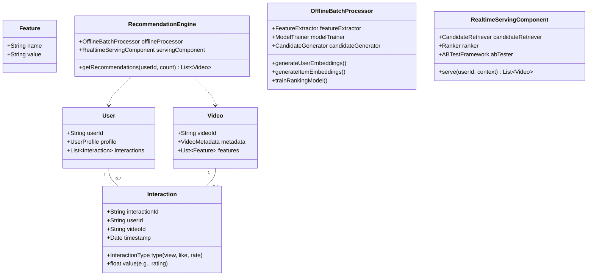

# Lab 6: Distributed Recommendation Engine

## 📚 Concepts to Learn

- Recommendation System Paradigms: Collaborative Filtering, Content-Based Filtering, Hybrid Approaches.
- Data Pipelines for ML: Data Ingestion, Preprocessing, Feature Engineering, Model Training, Deployment.
- Batch Processing vs. Real-Time (or Near Real-Time) Recommendation Generation.
- Graph Databases (e.g., Neo4j, Amazon Neptune): Use cases for modeling relationships (user-item, item-item).
- Machine Learning Integration: Serving ML models, A/B testing recommendations.
- Cold Start Problem in recommendation systems.
- Scalability and Performance of recommendation serving.

## 📊 Required Data Structures

You must identify and represent these in their diagrams:

- **Graphs:** To model user-item interactions, item-item similarity, or user-user similarity.
- **Priority Queues:** For selecting top-N recommendations.
- **Hash Maps/Dictionaries:** For user profiles, item features, model parameters, candidate lists.
- **Vectors/Embeddings:** For representing users and items in a latent feature space.

## Whiteboarding Challenge

### Scenario

Design a **Distributed Recommendation System** for a large-scale video streaming platform like YouTube or Netflix. The system should be able to generate personalized video recommendations for millions of users based on their viewing history, ratings, liked videos, and potentially other user interactions (searches, shares) as well as video metadata (genre, actors, description).

### Required Diagrams

For this lab, you will create the following three diagrams for the Distributed Recommendation System:

1.  **UML Class Diagram (Core Entities & Engine Components):**
    - **Action:** Create a UML Class Diagram.
    - **Content:** Model the key data entities and conceptual components of the recommendation engine.
      - **Data Entities:** `User` (with profile info), `Video/Item` (with metadata like genre, actors, and derived features/embeddings), `Interaction` (capturing events like `View`, `Like`, `Rating`, with associated values and timestamps).
      - **Engine Components (Conceptual Classes):** `FeatureExtractor` (processes raw data into features), `ModelTrainer` (trains recommendation models), `CandidateGenerator` (produces an initial list of recommendations), `Ranker` (scores and orders candidates), `RecommenderService` (overall orchestrator).
      - Show primary attributes for entities and key methods for components. Clearly depict relationships (e.g., `User` has many `Interactions`; `Video` has many `Interactions`).
2.  **Data Pipeline Flow Diagram (End-to-End Recommendation Generation):**
    - **Action:** Create a comprehensive flow diagram.
    - **Content:** Illustrate the complete data lifecycle for generating recommendations. This must cover distinct stages:
      - **Data Ingestion:** Show collection of `User Interaction Data` (views, likes, ratings) and `Video Metadata` from various sources.
      - **Data Processing & Feature Engineering:** Detail how raw data is cleaned, transformed, and used to generate `User Features/Embeddings` and `Item Features/Embeddings` (mention tools like Spark/Flink if applicable).
      - **Model Training (Batch):** Show the batch process of training recommendation models (e.g., Collaborative Filtering, Matrix Factorization, Deep Learning models) using the engineered features.
      - **Model Deployment & Storage:** Illustrate where and how trained models are stored (e.g., Model Registry) and how pre-computed recommendations or item/user embeddings are stored for efficient retrieval (e.g., Key-Value Store, Vector Database).
      - **Recommendation Serving (Real-time/Near Real-time):** Depict how a user request for recommendations triggers the serving pipeline, including candidate retrieval, feature fetching, ranking by a deployed model, and final list generation.
3.  **Graph Relationship Diagram (User-Video Interactions for Collaborative Filtering):**
    - **Action:** Create a Graph Diagram.
    - **Content:** Visually represent a small subset of users and videos as nodes.
      - Use edges to explicitly show different types of interactions (e.g., `UserA --viewed--> VideoX`, `UserB --rated(5_stars)--> VideoX`, `UserA --liked--> VideoY`).
      - Illustrate how these interactions can be used to infer similarity for collaborative filtering. For example, show how `UserA` and `UserB` might be considered similar due to common interactions with `VideoX`, leading to `VideoY` (liked by `UserA`) being a potential recommendation for `UserB`.
      - Optionally, show item-item similarity edges if relevant to your collaborative approach (e.g., `VideoX --similar_to--> VideoZ` because many users who watched X also watched Z).

### Critical Architectural Decisions (Visualize and Justify)

1.  **Batch vs. Real-Time Recommendation Pipelines (or Hybrid):**
    - **Visualization:** Diagram the chosen pipeline. If hybrid, show which parts are batch (e.g., model training, generating embeddings) and which are real-time (e.g., final ranking based on recent activity, candidate generation from pre-computed lists).
    - **Justification:** Explain the rationale for the chosen approach. Discuss the trade-offs between freshness of recommendations, computational cost, and implementation complexity.
2.  **Storage of User Interaction History and Item Features:**
    - **Visualization:** Show where different types of data are stored (e.g., raw interaction logs in a data lake like S3/HDFS, processed user/item features in a NoSQL DB or feature store, item embeddings in a vector database or key-value store).
    - **Justification:** Defend the choice of storage solutions for different data types based on access patterns, scale, consistency requirements, and query capabilities.
3.  **Choice Between Graph Database and Relational/NoSQL Models for User-Item Interactions:**
    - **Visualization:** A small schema comparison showing how user-video interactions would be modeled in a graph DB (nodes and relationships) versus a relational DB (tables like `users`, `videos`, `views`) or a document NoSQL DB.
    - **Justification:** Discuss the pros and cons of using a graph database for managing and querying complex relationships inherent in recommendation systems (e.g., finding users who watched similar videos, multi-hop connections) versus using more traditional databases.

## ⚖️ Trade-off Discussion Points

1.  **Offline (Batch) vs. Online (Real-time/Near Real-time) Recommendation Generation & Evaluation:**

    - **Visual Analysis:**
      - **Pros/Cons Table:**
        | Feature | Offline/Batch Recommendations | Online/Near Real-Time Recommendations |
        |---------------------|--------------------------------------|----------------------------------------|
        | Data Freshness | Less fresh (based on last batch run) | More fresh (adapts to recent activity) |
        | Computational Cost | Can be high (large batch jobs) | Lower per-request, but constant load |
        | Latency (Serving) | Low (pre-computed) | Potentially higher (on-the-fly compute)|
        | Complexity | Simpler serving, complex batch pipeline| Complex serving logic, stream processing|
        | Adaptability | Slower to adapt to new trends/users | Faster adaptation |
        | A/B Testing | Easier to A/B test different models | More complex to manage online A/B tests|
      - **Decision Tree/Flowchart:** Factors influencing the choice between batch, real-time, or hybrid approaches.
        ```mermaid
        graph TD
            A{Need for Recommendation System} --> B{How critical is recommendation freshness?};
            B -- Very Critical (e.g., news feed) --> C{Can compute recommendations on-the-fly within latency budget?};
            C -- Yes --> D[Consider Online/Near Real-Time];
            C -- No --> E[Consider Hybrid: Batch Pre-computation + Real-Time Re-ranking/Filtering];
            B -- Moderately Critical --> E;
            B -- Less Critical (e.g., weekly digest) --> F[Consider Batch Processing];
            D --> G{Resource Intensive Models?};
            G -- Yes --> E;
            G -- No --> D;
        ```
    - **Discussion:** Debate the scenarios where fully batch-generated recommendations are sufficient versus when real-time updates are crucial for user experience. How does A/B testing differ between these approaches?

2.  **Data Freshness vs. Computational Cost & Complexity:**
    - **Visual Analysis:**
      - **Graph/Slider:** Show a conceptual graph where increasing data freshness (e.g., reducing batch intervals, more real-time components) leads to an increase in computational cost and system complexity.
      - **Component Diagram:** Illustrate two scenarios: one with a daily batch job for all recommendations, and another with a streaming pipeline that updates a user's candidate pool based on their last few interactions, supplemented by a less frequent full batch model retrain.
    - **Discussion:** How frequently do recommendation models need to be retrained? How often should user profiles or item embeddings be updated? Discuss the diminishing returns of extremely fresh data versus the escalating costs and complexity. Consider different parts of the recommendation (e.g., candidate generation vs. ranking).

## 📝 Gandalf Notes

### Common Design Pitfalls:

- **The Cold Start Problem:** Not having a strategy for new users or new items with no interaction data.
- **Scalability of Candidate Generation:** Naively trying to score all items for all users.
- **Ignoring Diversity and Serendipity:** Recommendations become too narrow or obvious.
- **Feedback Loops:** Popular items get recommended more, becoming even more popular, regardless of true relevance.
- **Evaluation Metrics:** Focusing only on accuracy (e.g., click-through rate) and ignoring other factors like user satisfaction, diversity, novelty.
- **Data Sparsity:** Many user-item matrices are very sparse, making collaborative filtering difficult.
- **Real-time infrastructure complexity:** Underestimating the engineering effort for real-time feature updates and model serving.

### Ideal Visual Solutions:

- **UML Class Diagram:** Clear separation of data entities (User, Item, Interaction) from processing components (FeatureExtractor, CandidateGenerator, Ranker).
- **Data Pipeline Flow:** A multi-stage diagram showing data sources, batch processing (Spark/Flink), model training, model storage, and the serving layer with API endpoints.
- **Graph Diagram:** Nodes for users and items, with different types of edges (viewed, liked, rated). Show how paths in the graph can lead to recommendations (e.g., "users who liked X also liked Y").

### Key Discussion Points:

- Different types of recommendation algorithms (collaborative, content-based, knowledge-based, hybrid).
- Techniques for addressing the cold start problem (e.g., using content features, asking for preferences, recommending popular items).
- The importance of feature engineering for recommendation quality.
- How to evaluate the effectiveness of a recommendation system (offline metrics like precision/recall, NDCG; online A/B testing).
- The role of exploration vs. exploitation in recommendations.
- Ethical considerations: filter bubbles, fairness, bias in recommendations.

### Example Diagrams:

**1. UML Class Diagram (Conceptual for Recommendation Engine - Mermaid):**



_Supporting Code Example (Conceptual - Python/Java like pseudocode for core entities):_

```python
class User:
    def __init__(self, user_id: str):
        self.user_id = user_id
        # self.profile, self.interactions

class Video:
    def __init__(self, video_id: str):
        self.video_id = video_id
        # self.metadata, self.features (embeddings, genre, etc.)

class Interaction:
    def __init__(self, user_id: str, video_id: str, interaction_type: str, timestamp):
        self.user_id = user_id
        self.video_id = video_id
        self.interaction_type = interaction_type # e.g., "view", "like", "rating"
        self.timestamp = timestamp
        # self.value (e.g. rating_value, view_duration_percentage)
```

**2. Data Pipeline Flow Diagram (High-Level - Mermaid):**

```mermaid
graph TD
    subgraph DataSources
        InteractionsDB[(User Interactions DB/Logs)]
        VideoMetadataDB[(Video Metadata DB)]
        UserProfileDB[(User Profile DB)]
    end

    subgraph DataIngestionAndStorage
        direction LR
        DataLake[Data Lake (S3/HDFS)]
        FeatureStore[Feature Store]
    end
    InteractionsDB --> DataLake
    VideoMetadataDB --> DataLake
    UserProfileDB --> DataLake

    subgraph BatchProcessingETL
        direction LR
        SparkFlink[Spark/Flink Jobs for ETL & Feature Engineering]
    end
    DataLake --> SparkFlink
    SparkFlink --> FeatureStore
    SparkFlink --> ProcessedDataForTraining[Processed Data for Training]

    subgraph ModelTrainingAndStorage
        direction LR
        ModelTraining[Model Training (Collaborative Filtering, Matrix Factorization, DNNs)]
        ModelRegistry[Model Registry / Storage]
        PrecomputedRecs[(Precomputed Recommendations / Embeddings Store)]
    end
    ProcessedDataForTraining --> ModelTraining
    FeatureStore --> ModelTraining
    ModelTraining --> ModelRegistry
    ModelTraining -- Generate/Store --> PrecomputedRecs

    subgraph RecommendationServingAPI
        direction LR
        RecAPI[Recommendation API Service]
        CandidateGen[Candidate Generation]
        Ranking[Ranking Service]
        ABTesting[A/B Testing Logic]
    end
    UserRequest[User Request for Recommendations] --> RecAPI
    RecAPI --> CandidateGen
    CandidateGen -- Uses --> PrecomputedRecs
    CandidateGen -- Uses --> FeatureStore # For real-time features
    CandidateGen --> Ranking
    Ranking -- Loads Model --> ModelRegistry
    Ranking -- Uses --> FeatureStore # For real-time features
    Ranking --> ABTesting
    ABTesting --> UserResponse[Personalized Recommendations]
```

**3. Graph Relationship Diagram (User-Video Interactions - Mermaid):**

```mermaid
graph LR
    subgraph Users
        U1[User A]
        U2[User B]
        U3[User C]
    end
    subgraph Videos
        V1[Video X (Action)]
        V2[Video Y (Action)]
        V3[Video Z (Comedy)]
        V4[Video W (Action)]
    end

    U1 -- "viewed" --> V1
    U1 -- "liked" --> V2
    U1 -- "rated(5)" --> V1
    U2 -- "viewed" --> V1
    U2 -- "viewed" --> V3
    U2 -- "liked" --> V3
    U3 -- "viewed" --> V2
    U3 -- "viewed" --> V4

    V1 -. "similar_genre" .-> V2
    V1 -. "similar_genre" .-> V4
    V2 -. "similar_genre" .-> V4

    U1 -. "similar_taste_to (derived)" .-> U2

    style U1 fill:#f9f,stroke:#333,stroke-width:2px
    style U2 fill:#f9f,stroke:#333,stroke-width:2px
    style U3 fill:#f9f,stroke:#333,stroke-width:2px
    style V1 fill:#ccf,stroke:#333,stroke-width:2px
    style V2 fill:#ccf,stroke:#333,stroke-width:2px
    style V3 fill:#cfc,stroke:#333,stroke-width:2px
    style V4 fill:#ccf,stroke:#333,stroke-width:2px
```

### Recommended Tools:

- Physical Whiteboards + Markers
- Digital Whiteboarding: Miro, Lucidspark
- Diagramming Tools: Lucidchart, draw.io (diagrams.net)
- Mermaid.js for markdown-based diagrams.

---
