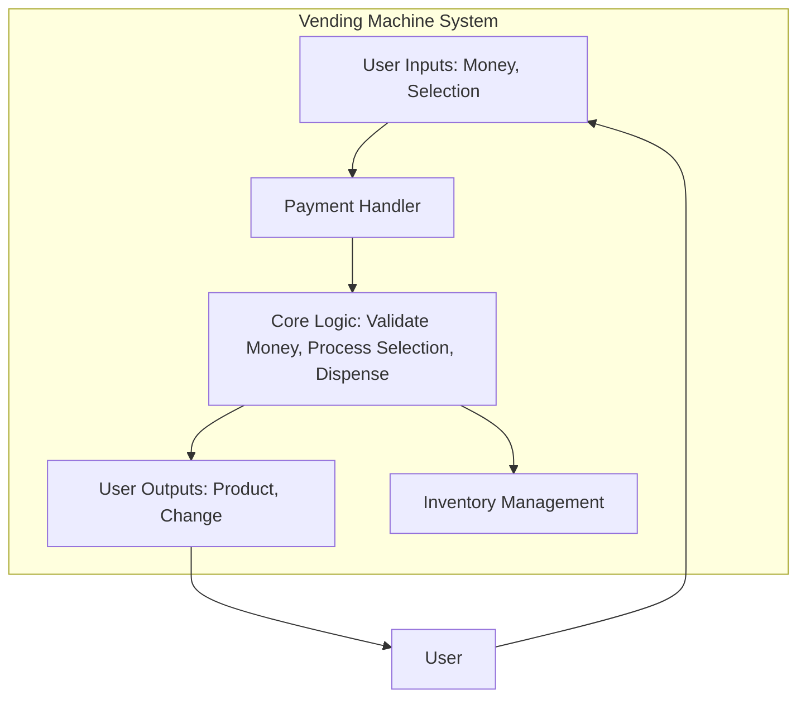
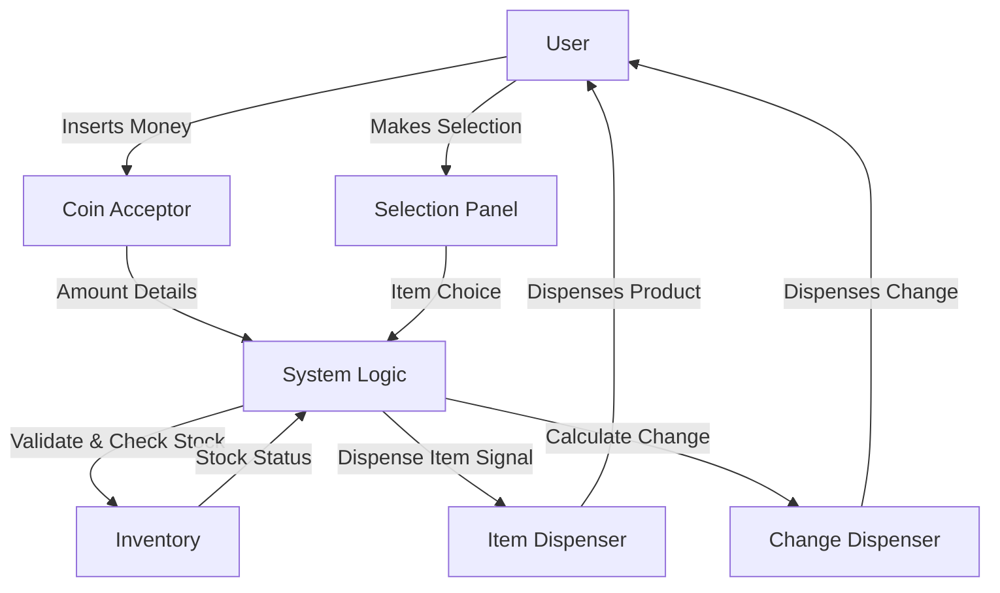

# Lab 1: What is a System?

## 🎯 Concepts to Learn

- Inputs: What goes into a system.
- Outputs: What comes out of a system.
- Components: The basic building blocks of a system.
- Simple Data Flow: How information moves through a system.

---

## ✍️ Required Diagrams

For this lab, you will create the following diagrams to visualize the Vending Machine system:

1.  **Basic System Block Diagram:**
    - **Action:** Create a block diagram.
    - **Content:** Clearly illustrate the overall Vending Machine system, its main components (e.g., coin acceptor, item dispenser, display), and define its boundaries (what's inside vs. outside the system). Show high-level inputs and outputs.
2.  **Simple Data Flow Diagram (DFD):**
    - **Action:** Create a data flow diagram.
    - **Content:** Show specifically how data (e.g., money, selection, commands, product information, change) flows between the identified components of the Vending Machine. Use arrows to indicate data movement and label the data.

---

## 💡 Whiteboarding Challenge

**Problem:** Diagram a **Vending Machine** as a system.

**Architectural Decisions to Visualize and Explain:**

1.  What are the main system components (e.g., coin acceptor, item dispenser, display)? Clearly define their inputs and outputs.
2.  How does data (money inserted, product selection, change dispensed) flow through the system?

---

## ⚖️ Trade-off Discussion Points

**Scenario:** Consider the vending machine. What are the trade-offs between a purely **manual vending machine** (e.g., an attendant takes money and gives items) versus an **automated vending machine**?

- Discuss aspects like cost, speed, reliability, user experience, and complexity.

---

## 🧙 Gandalf Notes

### Hints:

- Think about the vending machine from a user's perspective first.
- What does the user do? What does the machine do in response?
- Break down the machine into its most essential parts.
- For data flow, use simple arrows and labels.

### Common Pitfalls:

- Overcomplicating the components: Keep it high-level for beginners.
- Confusing data flow with physical item flow (though they can be related).
- Forgetting error states or alternative flows (e.g., "item out of stock," "insufficient funds"). Initially, focus on the primary success path.

### Example Diagrams:

**1. Basic System Block Diagram (Vending Machine):**

**2. Simple Data Flow Diagram (Vending Machine - Successful Purchase):**

### Presentation Focus:

- Clearly label each part of your diagram.
- Walk through your diagram, explaining the flow of actions or data.
- Emphasize that there's no single "right" answer, but clarity and justification for your decisions are key.
- Be prepared to present and explain your diagrams clearly to others.
