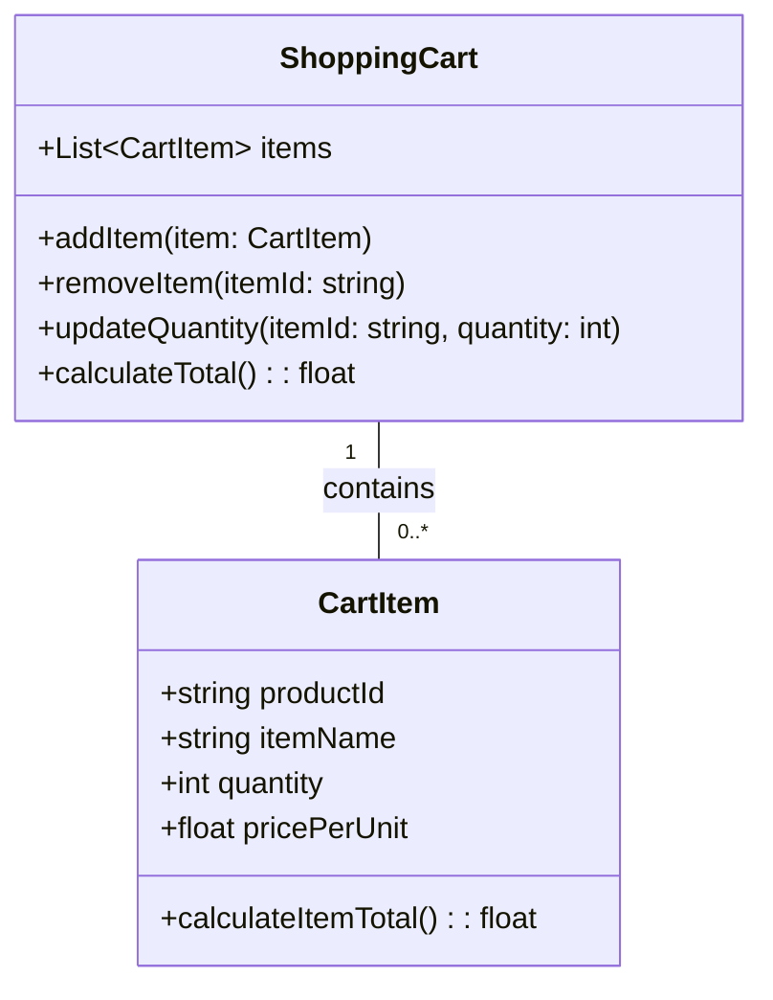
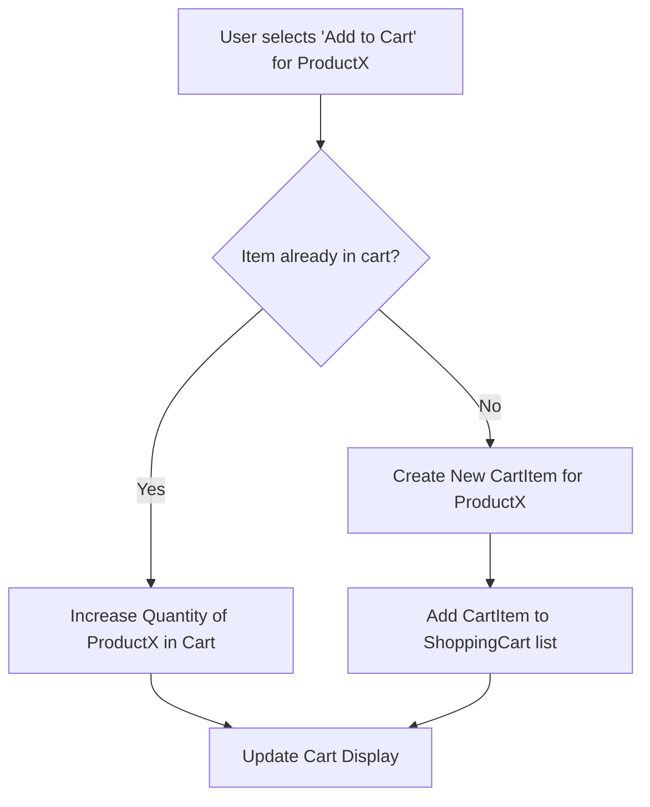

# Lab 2: Modeling Simple Data Structures

## 🎯 Concepts to Learn

- Arrays: Ordered collections of items.
- Lists: Flexible collections of items.
- Simple Relationships: How different pieces of data connect (e.g., a cart _has_ items).

---

## ✍️ Required Diagrams

For this lab, you will create the following diagrams to model the Shopping Cart system:

1.  **UML Class Diagram for a Shopping Cart:**
    - **Action:** Create a UML class diagram.
    - **Content:** Define the `ShoppingCart` and `CartItem` classes. For each class, specify key attributes (e.g., `CartItem` might have `productId`, `itemName`, `quantity`, `price`) and essential methods (e.g., `ShoppingCart` might have `addItem()`, `removeItem()`, `calculateTotal()`). Clearly show the relationship between `ShoppingCart` and `CartItem` (e.g., a `ShoppingCart` contains multiple `CartItems`).
2.  **Simple Flow Diagram for Adding/Removing Items:**
    - **Action:** Create a flow diagram.
    - **Content:** Illustrate the precise sequence of steps the system takes when a user adds a specific item to their shopping cart. Separately, or on the same diagram if clear, illustrate the steps for removing an item. Show decision points (e.g., "Is the item already in the cart?").

---

## 💡 Whiteboarding Challenge

**Problem:** Model a **Shopping Cart** system for an online store.

**Architectural Decisions to Visualize and Explain:**

1.  How will you represent the items within the shopping cart (e.g., what attributes does a cart item need: name, price, quantity)?
2.  How will the system calculate the total price of all items in the cart?

---

## ⚖️ Trade-off Discussion Points

**Scenario:** When representing items in a shopping cart, what are the trade-offs between storing items as a **simple list of product IDs** versus a **list of detailed product objects** (each object containing ID, name, price, description, etc.)?

- Discuss data redundancy, ease of display, performance for calculating totals, and complexity.

---

## 🧙 Gandalf Notes

### Hints:

- For the UML Class Diagram, start with two main classes: `ShoppingCart` and `CartItem`.
- Think about the attributes (data) each class holds (e.g., `CartItem` might have `productId`, `itemName`, `quantity`, `price`).
- Think about the methods (actions) each class can perform (e.g., `ShoppingCart` might have `addItem()`, `removeItem()`, `calculateTotal()`).
- For the flow diagram, consider user actions: "User wants to add item X." What steps does the system take?

### Common Pitfalls:

- Making the UML diagram too complex initially. Focus on the core attributes and the relationship (a `ShoppingCart` _contains multiple_ `CartItems`).
- Forgetting to include item quantity in the `CartItem` or a way to manage it.
- In the flow diagram, not clearly showing decision points (e.g., "Is item already in cart?").

### Example Diagrams:

**1. UML Class Diagram (Shopping Cart):**

**2. Simple Flow Diagram (Adding an Item to Cart):**

### Presentation Focus:

- Explain the attributes and methods in your UML diagram.
- You need to articulate the relationship between `ShoppingCart` and `CartItem` (e.g., composition or aggregation).
- For the flow diagram, narrate the steps a user and the system take to add or remove an item.
- Be prepared to present and explain your diagrams clearly to others.
