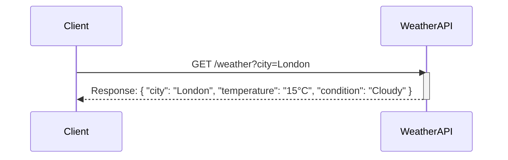
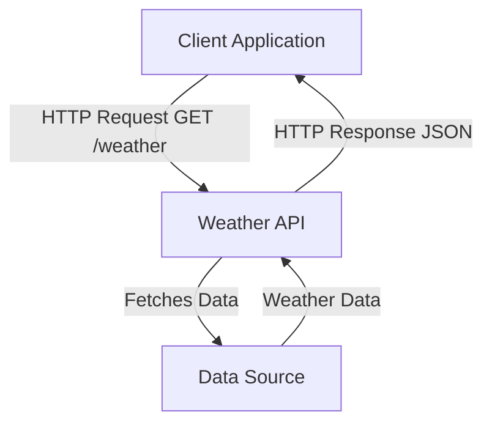

# Lab 3: Basic API Design Concepts

## 🎯 Concepts to Learn

- What is an API (Application Programming Interface): A way for different software systems to talk to each other.
- Simple Endpoint Design: Defining specific URLs (endpoints) to get or send data.
- Request/Response: The basic pattern of API communication.

---

## ✍️ Required Diagrams

For this lab, you will create the following diagrams for the Weather API design:

1.  **API Endpoint Flow Diagram (Request-Response):**
    - **Action:** Create a sequence diagram or a similar flow diagram.
    - **Content:** Detail the interaction for at least one specific API endpoint (e.g., `GET /weather?city=London`). Show a client making a request, the API receiving it, any internal processing (conceptual), and the API sending a response back to the client. Clearly label the request and response data.
2.  **Basic Component Diagram (System View):**
    - **Action:** Create a component diagram.
    - **Content:** Illustrate the main components: the `Client` (e.g., a mobile app), your `Weather API` itself, and a conceptual `Backend Data Source` (e.g., static files, an external weather service). Show the primary interactions and data flow between these components.

---

## 💡 Whiteboarding Challenge

**Problem:** Design a very simple API to **retrieve weather information** for a given city.

**Architectural Decisions to Visualize and Explain:**

1.  What API endpoints are needed? (e.g., `/weather?city=London`). How would a user request current temperature vs. a 3-day forecast (if you decide to support it)?
2.  Should the weather data be static (e.g., read from a pre-defined file for a few cities) or dynamically fetched (conceptually, from a "weather service")? How does this affect the API design?

---

## ⚖️ Trade-off Discussion Points

**Scenario:** For providing weather data, what are the trade-offs between the API serving data from **static JSON files** (one file per city with pre-written weather info) versus the API making **real-time calls to an external weather service API**?

- Discuss update frequency, data accuracy, development effort, cost (if the external API is paid), and reliability.

---

## 🧙 Gandalf Notes

### Hints:

- Emphasize that an API is like a menu in a restaurant: it lists what you can order (request) and what you'll get back (response).
- For endpoints, focus on a simple GET request. Example: `GET /weather?city=Paris`.
- The component diagram should be high-level: a `Client` (like a mobile app), your `Weather API`, and a `DataSource` (which could be a file or another service).

### Common Pitfalls:

- Getting bogged down in specific HTTP methods (POST, PUT, DELETE) too early. Stick to GET for simplicity.
- Overthinking the data format. Simple JSON is fine, or even just describing the data fields.
- Confusing the API with the underlying application logic. The API is the _interface_.

### Example Diagrams:

**1. API Endpoint Flow Diagram (Get Weather):**

**2. Basic Component Diagram (Weather API System):**

### Presentation Focus:

- Clearly define your chosen endpoint(s) and the expected request parameters (like `city`).
- Describe the data you expect the API to return.
- In the component diagram, explain the role of each component and how they interact to fulfill an API request.
- Be prepared to present and explain your diagrams clearly to others.
