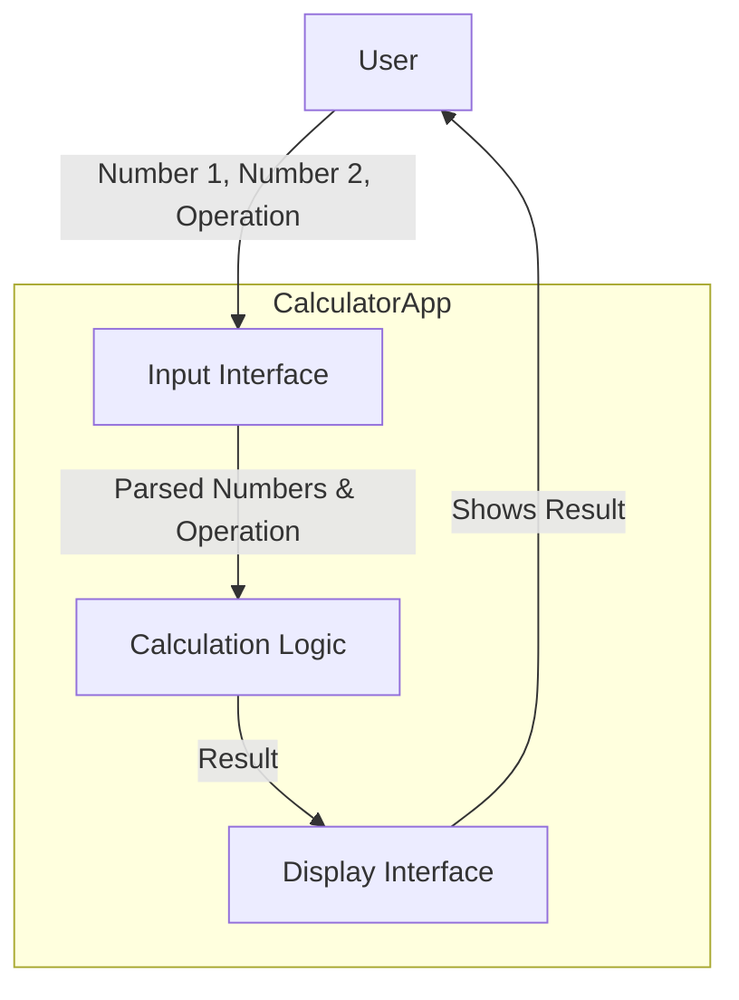
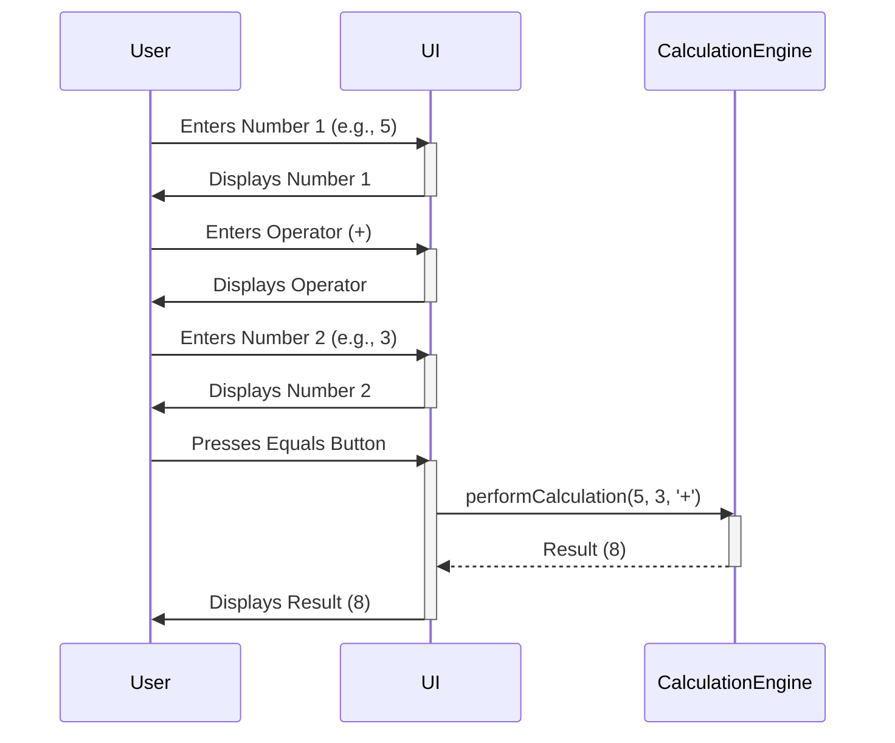

# Lab 4: Data Flow in Simple Applications

## 🎯 Concepts to Learn

- Data Inputs: How a system receives data (e.g., user typing, sensor readings).
- Processing: What the system does with the data (e.g., calculations, transformations).
- Data Outputs: How the system presents the results (e.g., display on screen, saved to a file).
- Basic Sequence of Operations: Understanding the order in which things happen.

---

## ✍️ Required Diagrams

For this lab, you will create the following diagrams for the Basic Calculator App:

1.  **Simple Data Flow Diagram (DFD):**
    - **Action:** Create a Data Flow Diagram.
    - **Content:** Show how data (specifically, the numbers entered by the user and the chosen arithmetic operation) moves from the point of input, through any processing steps (e.g., parsing input, performing calculation), to the final output displayed to the user. Identify key processes and data stores (even if conceptual, like "temporary number storage").
2.  **Sequence Diagram (User Interaction for Addition):**
    - **Action:** Create a UML Sequence Diagram.
    - **Content:** Illustrate the chronological sequence of interactions for a single addition operation (e.g., `5 + 3`). Show the `User`, the `User Interface (UI)`, and a `Calculation Engine` as participants. Detail the messages passed between them, such as entering numbers, selecting the operation, triggering the calculation, and displaying the result.

---

## 💡 Whiteboarding Challenge

**Problem:** Diagram a **Basic Calculator App** that can perform addition and subtraction of two numbers.

**Architectural Decisions to Visualize and Explain:**

1.  How does user input (numbers and the chosen operation like '+' or '-') move through the application components (e.g., from UI to a calculation module)?
2.  Where does the actual calculation (addition or subtraction) happen? Is it a distinct component or part of another?

---

## ⚖️ Trade-off Discussion Points

**Scenario:** For the calculator app, consider where the calculation logic resides. What are the conceptual trade-offs between having **all logic (UI and calculation) in one single block (centralized)** versus having the **UI as one block and the calculation logic as a separate block (distributed, even if simple)**?

- Discuss simplicity, potential for reuse of calculation logic (e.g., if you added a scientific calculator mode later), and ease of understanding (keep it very basic and conceptual).

---

## 🧙 Gandalf Notes

### Hints:

- For the DFD, think about external entities (User), processes (Input Number, Select Operation, Calculate, Display Result), and data stores (Temporary Storage for Numbers).
- The sequence diagram should show messages passed: User enters number 1, User enters number 2, User presses '+', Calculator computes, Calculator displays result.
- Keep components very high-level: `UserInterface`, `CalculationEngine`.

### Common Pitfalls:

- DFD: Making it too granular or too similar to a flowchart. Focus on _data_ movement, not control flow.
- Sequence Diagram: Getting lost in too many messages or components. Stick to the primary interaction path.
- Forgetting to show where the input numbers and the operation type are temporarily stored or passed to the calculation logic.

### Example Diagrams:

**1. Simple Data Flow Diagram (DFD - Calculator):**

**2. Sequence Diagram (Calculator - Addition):**

### Presentation Focus:

- For DFDs, explain what data is flowing and what transformation each process performs.
- For sequence diagrams, describe the timeline of interactions and the messages passed between components to achieve a result.
- Discuss how your chosen component breakdown (for architectural decisions) helps or hinders understanding the data flow.
- Be prepared to present and explain your diagrams clearly to others.
