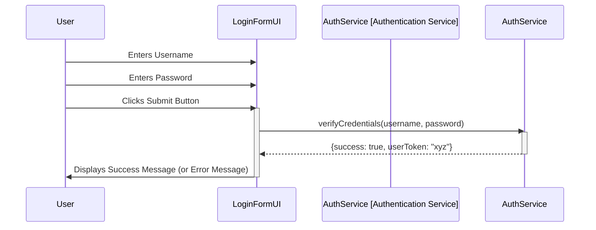
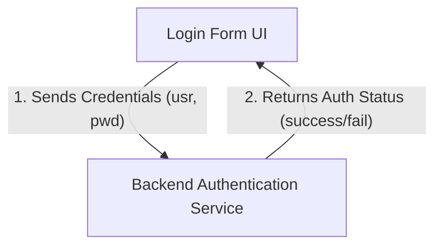

# Lab 5: Visualizing User Interactions

## 🎯 Concepts to Learn

- User Interfaces (UI): How users interact with a system (e.g., buttons, forms).
- Frontend-Backend Communication: The (conceptual) idea that the UI (frontend) might talk to a separate part that does the work (backend).
- User Actions and System Responses: Mapping what the user does to what the system does in return.

---

## ✍️ Required Diagrams

For this lab, you will create the following diagrams for the Simple Login Form:

1.  **UML Sequence Diagram (Login Attempt):**
    - **Action:** Create a UML Sequence Diagram.
    - **Content:** Detail the precise step-by-step interactions that occur when a user enters their username and password and clicks the "Submit" button. Participants should include the `User`, the `Login Form UI`, and a conceptual `Authentication Service` (backend). Show messages for data input, submission, credential verification (request and response), and the display of a success or failure message to the user.
2.  **Basic Component Diagram (Login System Components):**
    - **Action:** Create a Component Diagram.
    - **Content:** Show the primary components involved: the `User Interface (Login Form)` and a conceptual `Backend Authenticator` component. Clearly illustrate their interaction, focusing on how login credentials are passed and how an authentication result is returned.

---

## 💡 Whiteboarding Challenge

**Problem:** Design the interaction flow for a **Simple Login Form** (username and password).

**Architectural Decisions to Visualize and Explain:**

1.  What happens step-by-step when a user enters their username and password and clicks the "Submit" button? Show the flow of information.
2.  Conceptually, should the authentication check (verifying username/password) happen directly in the UI code, or should the UI send the credentials to a separate (conceptual) backend component for verification?

---

## ⚖️ Trade-off Discussion Points

**Scenario:** For user authentication, what are the basic trade-offs between performing **validation and authentication checks primarily on the client-side/locally** (e.g., simple checks in the browser, or against a small local list) versus **sending credentials to a server for server-side authentication**?

- Discuss security implications (even at a high level), user experience (e.g., speed of feedback for simple errors), and complexity.

---

## 🧙 Gandalf Notes

### Hints:

- For the sequence diagram, participants should be `User`, `LoginFormUI`, and `AuthenticationService` (or `Backend`).
- Messages would include `enterUsername()`, `enterPassword()`, `clickSubmit()`, `verifyCredentials()`, `authenticationResponse()`, `displayMessage()`.
- The component diagram is high-level: one box for UI, one for the backend logic that checks passwords.

### Common Pitfalls:

- Sequence Diagram: Making it too complex with too many backend components. Keep `AuthenticationService` as a single black box for this exercise.
- Component Diagram: Not clearly showing the direction of communication (UI sends credentials to Backend, Backend sends response to UI).
- Not considering both success and failure paths in the login flow (e.g., what happens if the password is wrong?).

### Example Diagrams:

**1. UML Sequence Diagram (User Login):**

**2. Basic Component Diagram (Login System):**

### Presentation Focus:

- Narrate the sequence of events in your login diagram, explaining what each component does.
- Justify your choice for where authentication happens (client vs. server-side conceptually) from the whiteboarding challenge.
- Encourage discussion on why sending passwords to a backend is generally more secure, even if the backend is just conceptual at this stage.
- Be prepared to present and explain your diagrams clearly to others.
