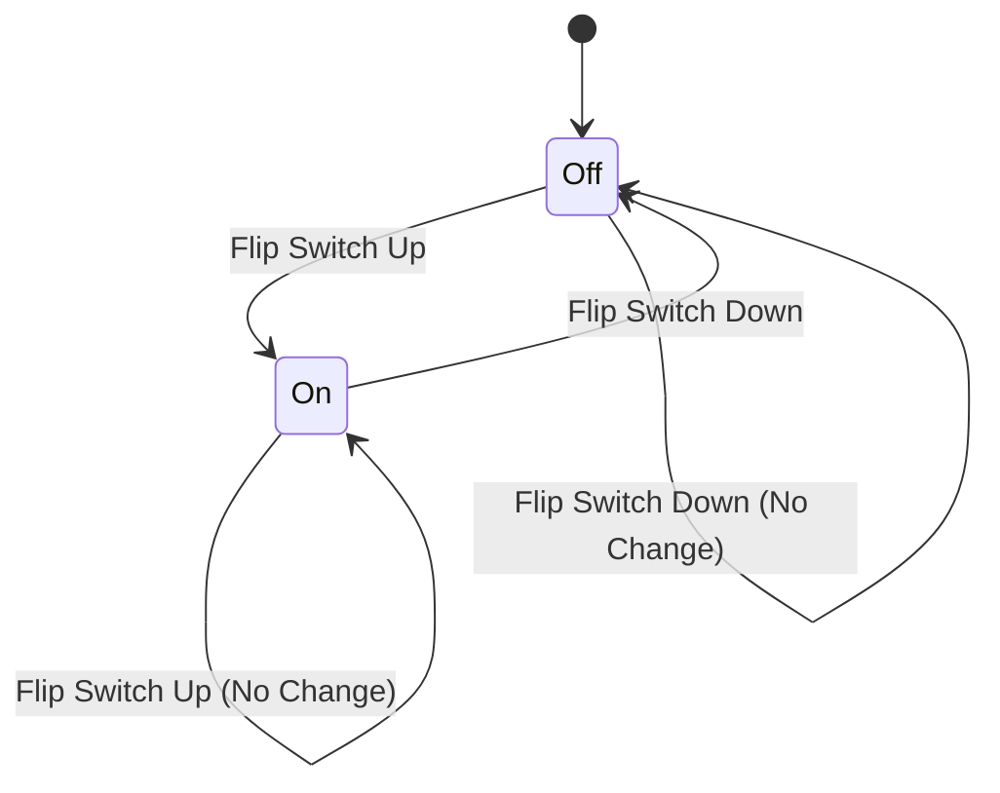
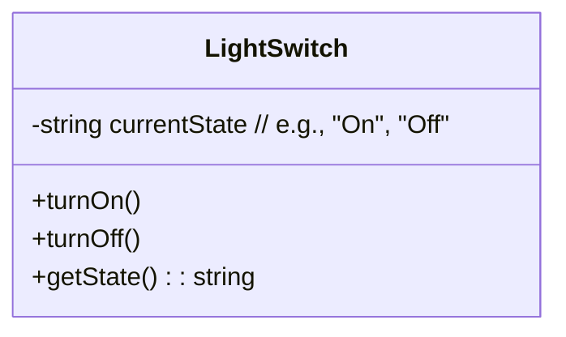

# Lab 6: Introduction to State Management

## 🎯 Concepts to Learn

- What is State: The condition or data a system is in at a particular time.
- State Transitions: How a system moves from one state to another based on events or inputs.
- Representing State: Simple ways to think about and model different states.

---

## ✍️ Required Diagrams

For this lab, you will create the following diagrams for the Light Switch system:

1.  **State Transition Diagram (Light Switch States):**
    - **Action:** Create a State Transition Diagram.
    - **Content:** Clearly define the states of the light switch (e.g., 'On', 'Off'). Show all possible transitions between these states. Label each transition with the specific action or event that causes it (e.g., "Flip Switch Up", "Flip Switch Down"). Indicate the initial state.
2.  **Basic Class Diagram (Light Switch Model):**
    - **Action:** Create a UML Class Diagram.
    - **Content:** Define a `LightSwitch` class. This class must include an attribute to represent its current state (e.g., `currentState` which could be a string like "On"/"Off" or a boolean). Include methods that can be used to change the state (e.g., `turnOn()`, `turnOff()`) and a method to query the current state (e.g., `getState()`).

---

## 💡 Whiteboarding Challenge

**Problem:** Model a **Light Switch System** that has 'On' and 'Off' states.

**Architectural Decisions to Visualize and Explain:**

1.  How does the system change state (e.g., what action triggers a change from 'Off' to 'On', and vice-versa)?
2.  How should the system handle invalid transitions or actions (e.g., what if someone tries to turn an already 'On' switch 'On' again, or an 'Off' switch 'Off' again)? Should it ignore the action, show an error, or something else?

---

## ⚖️ Trade-off Discussion Points

**Scenario:** Consider a simple web page that displays a counter. What are the conceptual trade-offs between a **stateless system** (where every click to increment the counter sends the current count to a server, which then sends back the new count) versus a **stateful system** (where the browser itself remembers the current count and just updates it locally, perhaps only sending the final count to a server occasionally)?

- Discuss simplicity, server load, responsiveness to the user, and data consistency (keep it very conceptual and high-level).

---

## 🧙 Gandalf Notes

### Hints:

- For the State Transition Diagram, states are circles/nodes, and transitions are arrows labeled with the event/action causing the change (e.g., "Flip Switch Up").
- The Class Diagram should be very simple: a `LightSwitch` class, an attribute like `currentState` (which could be a string or boolean), and methods like `turnOn()`, `turnOff()`, `getState()`.
- Real-world analogy: A traffic light (Red, Yellow, Green states) or a game character (Idle, Walking, Running, Jumping states).

### Common Pitfalls:

- State Diagram: Confusing states with actions. States are nouns (On, Off), actions are verbs (Flip Switch).
- Class Diagram: Adding too much complexity. The core is just the state and how to change/query it.
- Overlooking initial state: What state is the light switch in when the system starts?

### Example Diagrams:

**1. State Transition Diagram (Light Switch):**

**2. Basic Class Diagram (Light Switch):**

### Presentation Focus:

- Clearly explain the states, transitions, and triggering events in your state diagram.
- For the class diagram, describe the attributes that hold state and the methods that modify or query it.
- Discuss your approach to handling invalid transitions based on the whiteboarding challenge.
- Relate the concept of state to other everyday systems you might be familiar with.
- Be prepared to present and explain your diagrams clearly to others.
