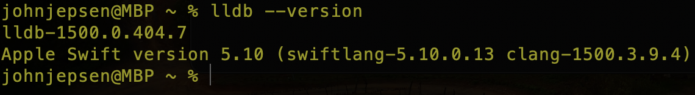

```
 (     (    (
 )\ )  )\ ) )\ )    (
(()/( (()/((()/(  ( )\
 /(_)) /(_))/(_)) )((_)
(_))  (_)) (_))_ ((_)_
| |   | |   |   \ | _ )
| |__ | |__ | |) || _ \
|____||____||___/ |___/

```

In the tranquil town of Bashlandia, an evil entity known as the Compiler wreaked havoc, causing programs to crash and citizens to despair. Just when hope seemed lost, a hero named Debuggerman emerged, wielding the powerful tools of LLDB. With unwavering determination, Debuggerman set breakpoints, stepped through code, and inspected variables with precision. Each bug revealed and squashed brought newfound stability to Bashlandia's digital realm. Through tireless effort and expertise, Debuggerman vanquished the Compiler, restoring peace and functionality to the town, proving that even the toughest code could be conquered with the right tools and a sharp mind.

# Step 1: Install LLDB

LLDB is a powerful debugger that helps you find and fix bugs in your programs by allowing you to control the execution of your code. You compile your program with debug information using gcc -g, then load it into LLDB with lldb your_program. You can set breakpoints at specific lines or functions to pause execution (breakpoint set --name main), run your program (run), and step through your code line by line (next or step). LLDB lets you inspect the values of variables (print variable_name) and see the call stack to understand the flow of execution. This way, you can identify where things go wrong and make necessary corrections.

#### On macOS:

LLDB comes standard with terminal.app or xcode .

1. **Install Xcode Command Line Tools:**

   ```sh
   xcode-select --install
   ```

2. **Verify Installation:**
   ```sh
   lldb --version
   ```
   

#### On Windows:

LLDB can be installed as part of the LLVM package.

1. **Download and Install LLVM:**

   - Go to the [LLVM download page](https://releases.llvm.org/download.html).
   - Download the Windows installer for the latest stable release.
   - Run the installer and ensure that the "Add LLVM to the system PATH" option is checked.

2. **Verify Installation:**
   Open Command Prompt and run:
   ```sh
   lldb --version
   ```

#### On Linux:

LLDB can be installed via package managers.

1. **On Debian-based systems (e.g., Ubuntu):**

   ```sh
   sudo apt-get update
   sudo apt-get install lldb
   ```

2. **On Red Hat-based systems (e.g., Fedora):**

   ```sh
   sudo dnf install lldb
   ```

3. **Verify Installation:**
   ```sh
   lldb --version
   ```

### Step 5: Practical main with Detailed Steps

Let's go through an main of debugging a C program with LLDB using the code you provided.

#### main C Program (`main.c`):

```c
#include <stdio.h>

int main(int argc, char **argv) {
    int d = 2;
    printf("welcome to the program with a bug!\n");

    scanf("%d", d);

    printf("You gave me: %d", d);

    return 0;
}
```

#### Steps to Debug:

1. **Compile with Debug Information:**

   ```sh
   gcc -g -o main main.c
   ```

2. **Start LLDB:**

   ```sh
   lldb main
   ```

3. **Set a Breakpoint at `main`:**

   ```sh
   (lldb) breakpoint set --name main
   ```

4. **Run the Program:**

   ```sh
   (lldb) run
   ```

   You'll see output like:

   ```
   Process 12345 launched: '/path/to/main' (x86_64)
   welcome to the program with a bug!
   ```

5. **Step into `main`:**

   ```sh
   (lldb) step
   ```

6. **Print the Value of `d`:**

   ```sh
   (lldb) print d
   ```

7. **Step to the Next Line (to the `scanf`):**

   ```sh
   (lldb) next
   ```

8. **Notice the Bug:**
   You'll notice that `scanf` expects a pointer, but we are passing `d` by value. To fix the bug, modify the code as follows:

   ```c
   scanf("%d", &d);
   ```

9. **Recompile the Program:**

   ```sh
   gcc -g -o main main.c
   ```

10. **Restart LLDB:**

    ```sh
    (lldb) run
    ```

11. **Set the Breakpoint and Run Again:**

    ```sh
    (lldb) breakpoint set --name main
    (lldb) run
    ```

12. **Step Over `scanf`:**

    ```sh
    (lldb) next
    ```

13. **Print the Value of `d` After Input:**

    ```sh
    (lldb) print d
    ```

14. **Continue Execution:**

    ```sh
    (lldb) continue
    ```

15. **Exit LLDB:**
    ```sh
    (lldb) quit
    ```

By following these steps, you'll learn how to debug the program, identify the bug (passing `d` by value instead of by reference), and fix it. After fixing the bug, you can recompile and run the program again to ensure it works correctly. If you encounter any issues or need further assistance, feel free to ask!

# Basic Syntax Examples

### Compile Your C Program with Debug Information

To use LLDB effectively, compile your program with the `-g` option to include debugging information.

```sh
gcc -g -o main main.c
```

### Step 3: Start LLDB

Start LLDB by loading your program into it.

```sh
lldb main
```

### Step 4: Basic LLDB Commands

Here are some basic commands to get you started with LLDB.

**Run the program:**

```sh
(lldb) run
```

**Set a breakpoint at the start of `main` function:**

```sh
(lldb) breakpoint set --name main
```

**Continue running the program until the next breakpoint:**

```sh
(lldb) continue
```

**Print the value of a variable:**

```sh
(lldb) print variable_name
```

**Step to the next line of code (step over functions):**

```sh
(lldb) next
```

**Step into functions:**

```sh
(lldb) step
```

**Exit LLDB:**

```sh
(lldb) quit
```
